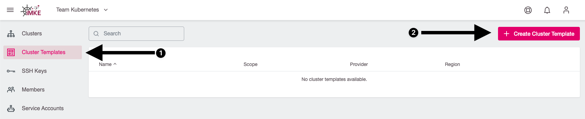
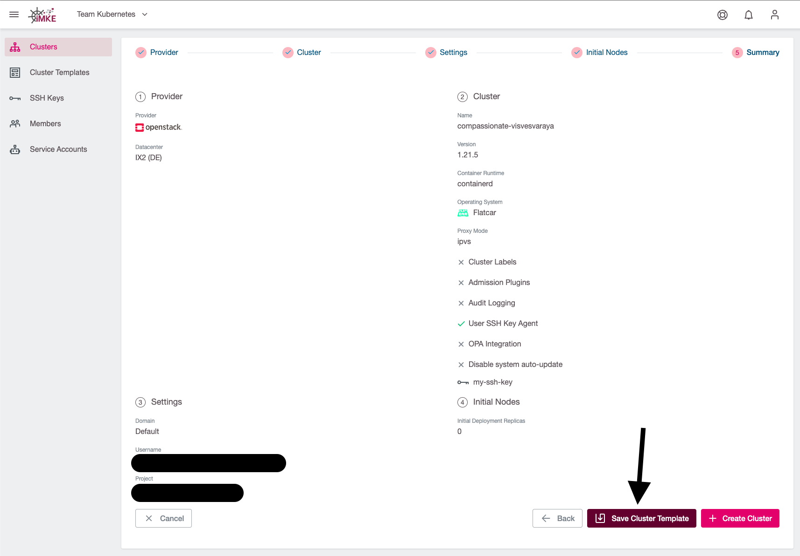
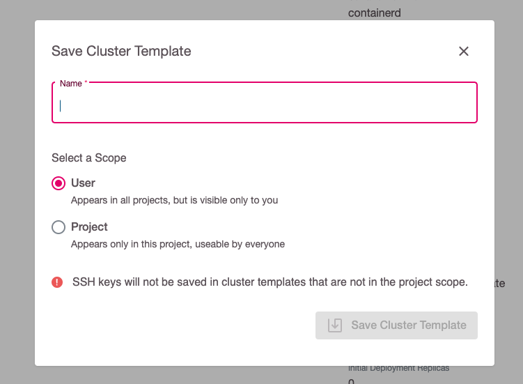
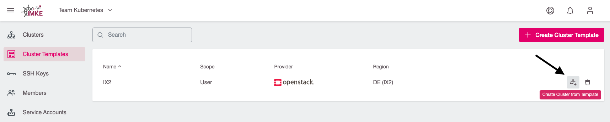
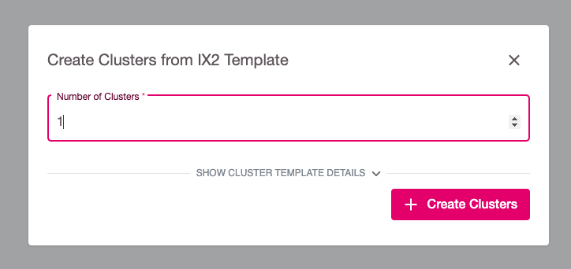
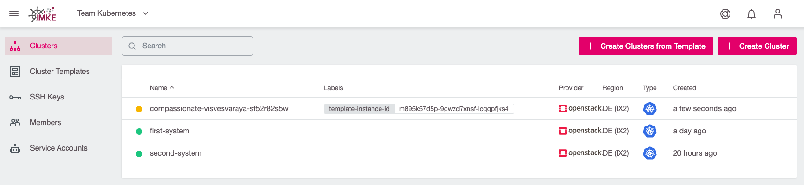
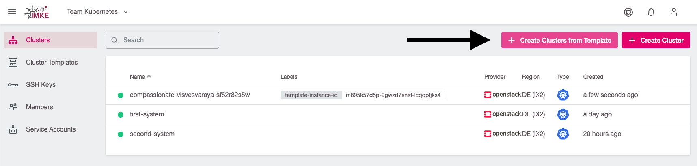

## What are cluster templates?

Cluster templates are templates that enable a fast and uniform creation of Kubernetes clusters. With Cluster Templates, clusters can be created with a few clicks without having to re-enter settings such as credentials, network settings and availability zones each time.

## Creation of cluster templates

To create a `Cluster Templates`, select the Cluster Templates menu item in the sidebar and then click the `Create Cluster` button.

The cluster creation process known from the section [`Creating a cluster`](/imke/clusterlifecycle/creatingacluster/) will then open. Enter all the data required for the cluster creation here. In the last step "Summary", do **not** click on `Create Cluster` but on `Save Cluster Template`.

Now the dialog `Save Cluster Template` opens. Here the desired name and storage scope can be defined.

Templates can be saved in 2 different scopes:

* On project level: All users of the project can use the template.
* On user level: The template can be used in all projects in which the user has write access. Other users cannot use the template.

The selection is confirmed by the `Save Cluster Template` button and the cluster template has thus been saved.

## Create cluster from template

New clusters can now be easily created from the template just created.

Select the menu item `Cluster Templates` in the sidebar. Now select the desired template and press the button `Create Cluster from Template`.

You will be asked how many clusters you want to create from this template. Enter a number and confirm the selection with `Create Clusters`.

The cluster or clusters are then created. Clusters created from cluster template are recognizable by the `template-instance-id` label.

**Note:** Another way to create clusters from templates can be found in the `Cluster` menu with the button `Create Clusters from Template`. The function is not different from the one just shown and is just a shortcut in the interface.

## Delete cluster template

To delete cluster templates, select the menu item `Cluster Templates` in the sidebar and the corresponding template. To delete, click the `Delete Cluster Template` button.

