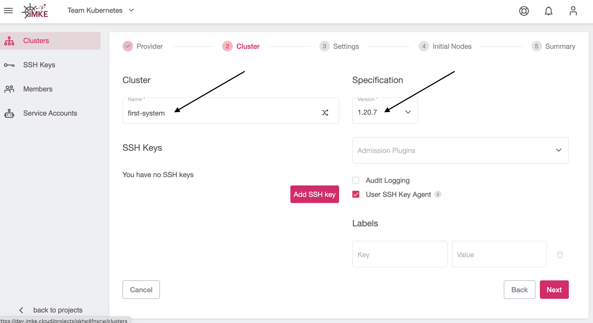
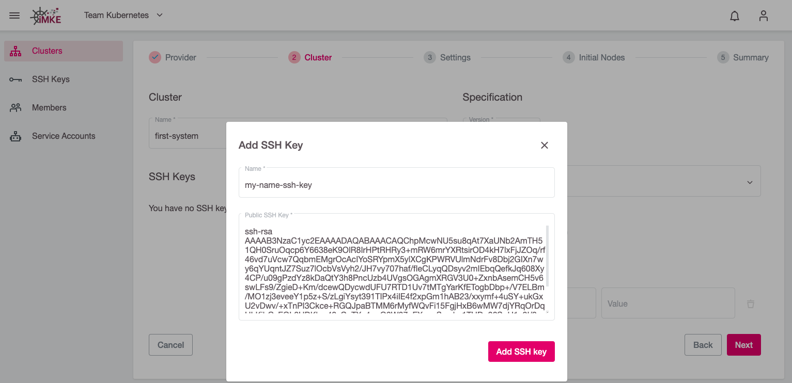
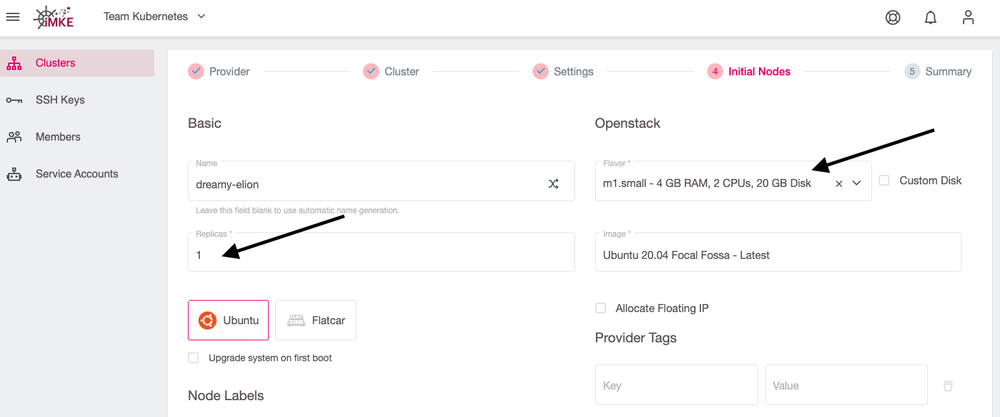
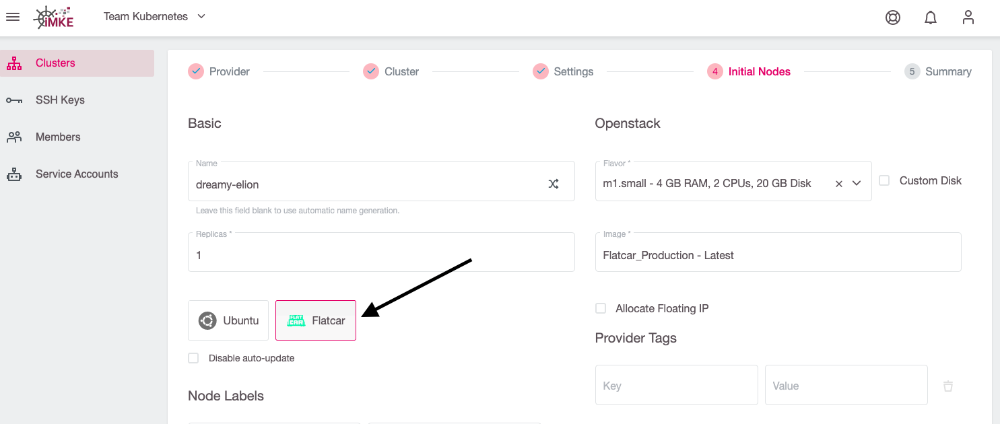

Einen Cluster in iMKE anzulegen benötigt nur ein paar Klicks.
Doch bevor wir dies tun können, benötigen wir ein Projekt.

Wenn Sie noch kein Projekt erstellt haben, [erstellen Sie bitte zuerst ein Projekt](/imke/managingprojects/creatingaproject).

Um einen Cluster anzulegen, klicken wir im gewünschten Projekt oben rechts auf `Create Cluster`:

Jetzt öffnet sich die erste Seite für den Prozess, einen Cluster anzulegen.
Dazu wählen wir den Provider `openstack` und eine der drei Verfügbarkeitszonen aus, in diesem Beispiel
nehmen wir `IX2`:

Im nächsten Schritt konfigurieren wir die Cluster-Details. In unserem Beispiel nennen wir das Cluster `first-system` und
wählen die gwünschte Kubernetes-Version aus:

Für den gelegentlichen SSH-Zugriff auf Worker-Nodes können wir optional einen öffentlichen SSH-Schlüssel hinterlegen.
Zum Hinzufügen eines SSH-Keys klicken wir auf `Add SSH Key`:

In dem sich öffnenden Dialog können wir dann unseren SSH Public Key eintragen
und ihm einen passenden Namen geben:

Damit iMKE in der OpenStack-Infrastruktur die notwendigen Ressourcen erzeugen kann,
geben wir im nächsten Schritt unsere Zugangsdaten ein. Danach wird der Inhalt im Feld `Project`
automatisch aktualisiert und wir können in der Dropdownliste unser gewünschtes OpenStack Projekt
auswählen:

Mit dem Hinzufügen der Credentials und dem Auswählen des OpenStack-Projekts sind alle
notwendigen Eingaben getätigt, so dass wir mit dem nächsten Schritt fortfahren können. Wenn wir das tun,
wird automatisch ein eigenes Netzwerk, Subnet sowie eine Security Gruppe für das neue Cluster erstellt.

Es ist allerdings auch möglich, ein existierendes Netzwerk verwenden, um den Cluster zu erstellen.
Dazu müssen wir das Netzwerk und das Subnetz auswählen. Diese müssen allerdings mit einem Router verbunden sein.
In unserer [OpenStack Dokumentation](/optimist/guided_tour/step10/) ist beschrieben, wie man einen Router erstellen 
und mit einem Netzwerk verbinden kann.

Im nächsten Schritt definieren wir, wie viele und welche virtuellen Maschinen als Worker-Nodes im Cluster verfügbar
sein sollen.

Zuerst geben wir dem so genannten `Machine Deployment` einen Namen. Für unser Testcluster nutzen wir dazu den Namensgenerator:

Danach spezifizieren wir die `Replicas` (Anzahl der Worker-Nodes im Kubernetes-Cluster) und den `Flavor` (den Maschinentyp), welcher
im Wesentlichen die Anzahl der verfügbaren CPU-Kerne und des RAMs bestimmt:

Weiterhin wählen wir `Flatcar` als Betriebssystem für die Worker-Nodes:

Über einen Klick auf `Next` gelangen wir zum letzten Schritt, wo wir noch einmal alle Einstellungen verifizieren und mittels `Create Cluster`
die Cluster-Erstellung starten können:

Nun wird das Cluster erstellt. Um auf die Informationen zugreifen zu können müssen
wir nun wieder auf die Cluster-Übersicht des Projektes und dort unser Cluster auswählen:

Nach der Auswahl unseres Cluster kommen wir nun auf die Seite mit allen Cluster-Details:

## Zusammenfassung

Folgende Schritte wurden erfolgreich durchgeführt und gelernt:

* Was ist ein iMKE Cluster
* Wie erstellt man ein iMKE Cluster

Herzlichen Glückwunsch! Dies sind alle notwendigen Steps um ein Kubernetes Cluster
in iMKE anzulegen. Wie dieses verwendet werden kann steht auf den nächsten Seiten.
