We can create a cluster in iMKE with a couple of clicks.
Before we can do that, there needs to be a project.

So if you don't have a project yet, [create a project first](/imke/managingprojects/creatingaproject).

To create the cluster, we click on `Add Cluster` in the top right corner:
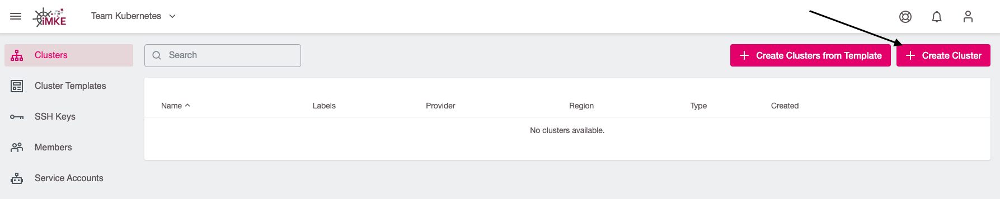

This opens the first page of the Cluster Creation procedure. In the example,
we call our Cluster `first-system` and select Kubernetes version 1.18.6:
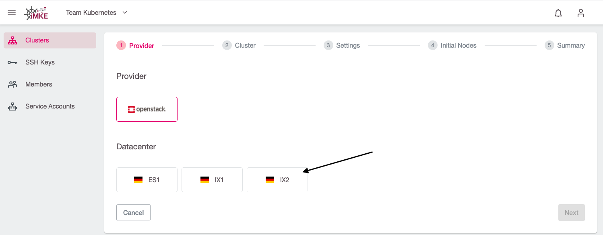

Then we click `Next` and choose the provider `openstack` and one of the three
availability zones. In this example, we pick `IX1`:
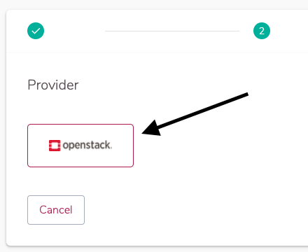 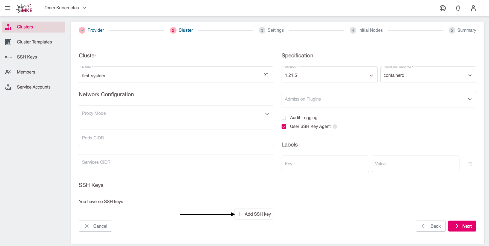

To allow iMKE to request the required resources from OpenStack, we add our
OpenStack credentials now. After that, the contents of `Project` is refreshed
automatically and we can choose the OpenStack project we want to run the cluster
in:
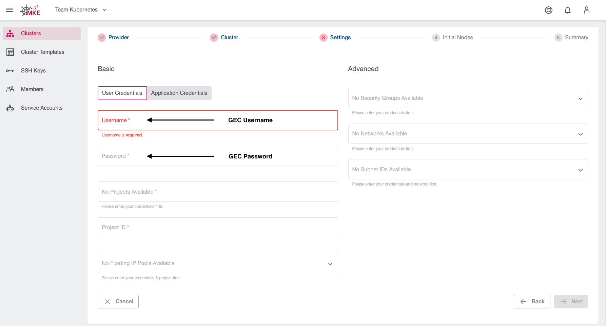
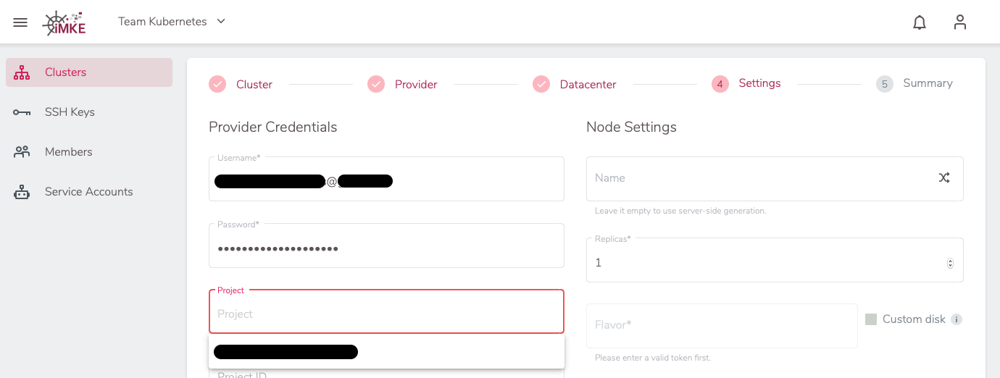

We can use an existing network to create the cluster. At this point, we must select the network and the subnet.
Those must be attached to a router.
So you have to create a router, this can be done from the Optimist Dashboard or from the OpenStack command line.
We can use our OpenStack documentation to create the router and attach it. (</optimist/guided_tour/step10/>)

In Node Settings we define how many virtual machines will be available as worker nodes
in the cluster. This node deployment needs a name and a size. For the first cluster
the name is not super important, so we use the random name generator. We use the
defaults for the number and size of the machines.
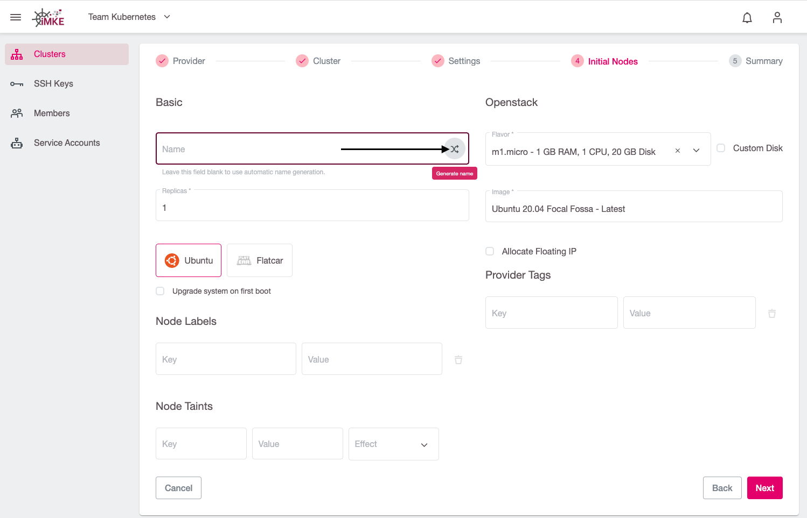

We choose Flatcar Linux as the image. Flatcar Linux is designed to run containers
and will automatically be updated by iMKE.
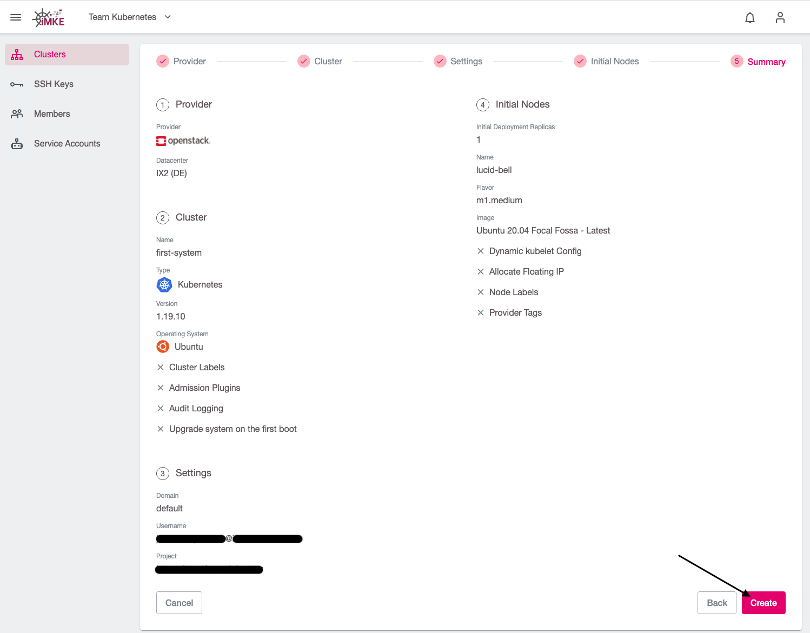

For occassional SSH access, we need to deploy an SSH Key and to assign a Floating IP to each Worker-Node.
To add an SSH-Key, we click on `Add SSH Key`, enter an SSH Public Key, and give it a memorable name:
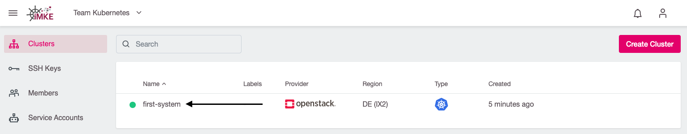
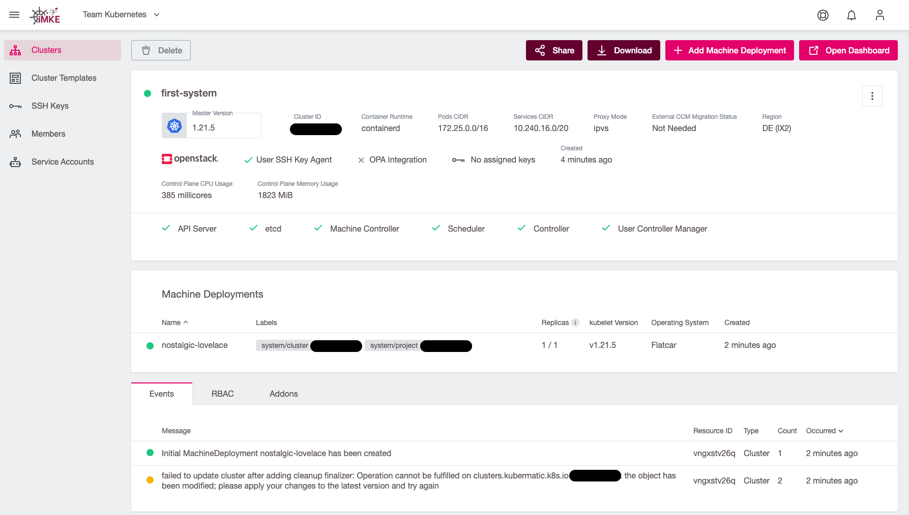

To finish, we click on `Next`. After we verified all settings, we click on `Create`.
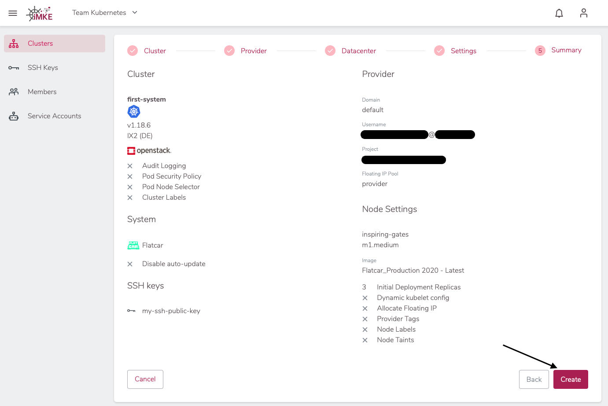

Now the cluster is being created. To access the information, we return to the Cluster
view of the project and click our Cluster's name.

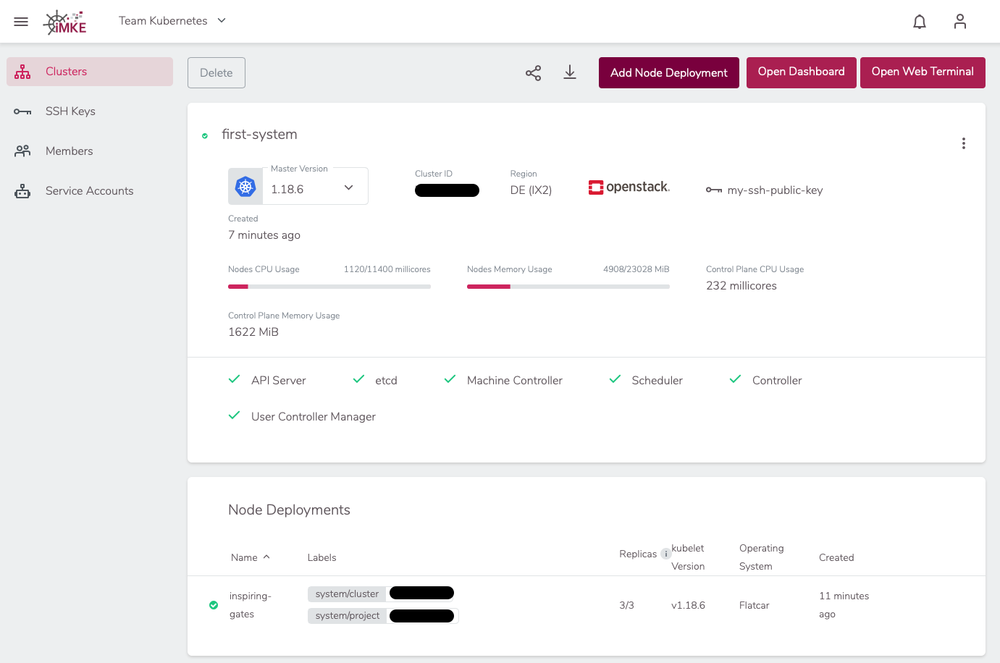

## Summary

In this guide, we achieved and learnt the following:

* What is an iMKE Project
* How to create an iMKE Project
* What is an iMKE Cluster
* How to configure an iMKE Cluster
* How to start an iMKE Cluster

Congratulations! Now you know how to create a Kubernetes Cluster with iMKE.
The following pages describe cluster usage examples.
