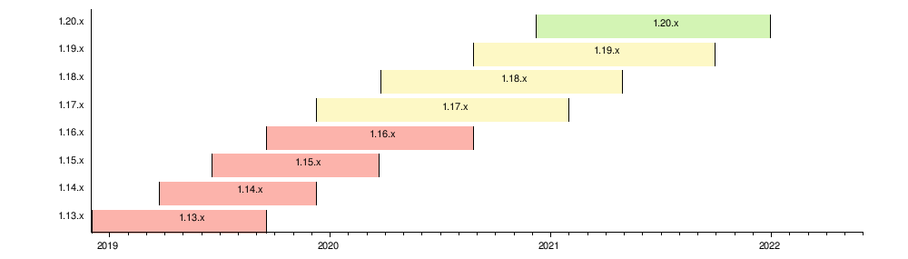

## Deprecation Policy in iMKE

Das offizielle Kubernetes Project veröffentlicht ungefähr vier Kubernetes Versionen pro Jahr und markiert die gleiche Anzahl an alten Versionen als veraltet. Bis einschließlich Version 1.18 hatte Kubernetes eine N-2 Supportrichtlinie, sprich die drei neuesten Versionen haben Sicherheits- und Fehlerkorrekturen erhalten.

Ab der Version v1.19 folgt Kubernetes einer N-3 Supportrichtlinie. Dies bedeutet, dass das Support-Fenster auf ein Jahr verlängert wurde.

Eine gute Visualisierung des Zeitraums, für den die einzelnen Versionen unterstützt werden/wurden sieht man auf dem folgenden Bild:

iMKE folgt diesem Lebenszyklus, indem fortlaufend neue Versionen eingeführt und ältere aus dem Support genommen werden.

Nachdem eine bestimme Kubernetes-Version das End-of-Life erreicht hat, werden keine Bugfixes oder Sicherheitsupdates mehr veröffentlicht. Daher können wir diese auch nicht mehr unterstützen und müssen sie aus dem Support nehmen.

## Der Deprecation Prozess

Wenn wir eine Kubernetes-Version aus dem Support nehmen, informieren wir die Kunden im Voraus über die Deprecation ("End-of-Life Ankündigung"), damit sie genügend Zeit haben, das Kubernetes-Upgrade selbst einzuplanen, vorzubereiten und durchzuführen.

Zu dem Zeitpunkt des angekündigten End-of-Life Datums wird dann die genannte Kubernetes-Version aus iMKE entfernt.

Die Liste der unterstützten Kubernetes-Versionen und ihre geplanten End-of-Life Daten finden Sie [hier](/imke/about/kubernetesversions). Eine ausführliche Dokumentation zum Ausführen von Cluster-Upgrades finden Sie [hier](../upgradingacluster/).

**Was bedeutet eine End-of-Life Ankündigung für mich?**

Wenn für eine bestimmte Kubernetes-Version eine End-of-Life-Ankündigung erfolgt ist, werden Kunden gebeten, ihre Cluster auf eine neuere Version (vorzugsweise die neueste) zu aktualisieren.

**Was passiert, wenn ich nicht bis zum EOL-Datum aktualisiere?**

Wenn ein Kundencluster vor dem Entfernen einer veralteten Kubernetes-Version nicht aktualisiert wird, geschieht zunächst nichts. Mit der entfernten Version können keine neuen Cluster mehr erstellt werden, aber vorhandene Cluster werden weiterhin funktionieren.

**Kann ich für immer auf einer EOL-Version bleiben?**

Nein, da dies in der Zukunft möglicherweise zu schwerwiegenden Sicherheitsproblemen führen könnte.

## iMKE Force-Upgrade Richtlinie

Wenn eine Kubernetes-Version das End-of-Life erreicht, müssen wir ihre Unterstützung von iMKE entfernen, da sie keine Bugfixes oder Sicherheitsupdates mehr erhält. Ab diesem Zeitpunkt ist es nicht mehr möglich, neue Cluster mit dieser Version zu erstellen.

Es ist wichtig, zwei technische Einschränkungen in Kubernetes hervorzuheben:

* Ein Kubernetes-Cluster (bzw. seine Control Plane) kann jeweils um eine Version aktualisiert werden, z. von v1.15 -> v1.16.
* Es ist nicht möglich, mehrere Versionen in einem Schritt zu aktualisieren.

Für unsere Kunden bedeutet dies, dass sie, wenn sie Ihre Cluster vor dem Entfernen der **nächsten** EOL-Version nicht aktualisieren, das Risiko eingehen, bei dem Entfernen der **nächsten** Version kein Upgrade durchführen zu können.

Dies würde ein ernstes Problem bedeuten, da ihre einzige Alternative darin besteht, einen neuen Cluster zu erstellen und den Workload von dem alten zu migrieren, da ein Upgrade nicht möglich wäre (da hierfür zwei Versionen in einem Schritt aktualisiert werden müssten).

Um solche Situationen zu vermeiden, müssen wir für Cluster, die mit einer bereits entfernten Kubernetes-Version ausgeführt werden, ein Upgrade aktiv erzwingen, bevor wir die nächste veraltete Version entfernen.

**Was passiert mit meinen Clustern während des Force-Upgrades?**

Wir werden ein automatisiertes Kubernetes-Upgrade für die Control-Plane und für die Node Deployments initiieren.

Dies **sollte** zwar funktionieren, aber ein erfolgreiches Upgrade kann aufgrund der Vielfalt der Anwendungen und Anwendungsfälle nicht garantiert werden.

Änderungen in der Kubernetes API können zu fehlerhaften / inkompatiblen Anwendungen innerhalb des Kubernetes-Clusters führen. **Wir können die Verantwortung für solche Probleme nicht übernehmen**.

Aus diesem Grund empfehlen wir jedem Kunden, das Kubernetes-Upgrade selbst einzuplanen und durchzuführen.
