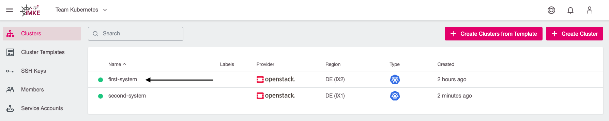
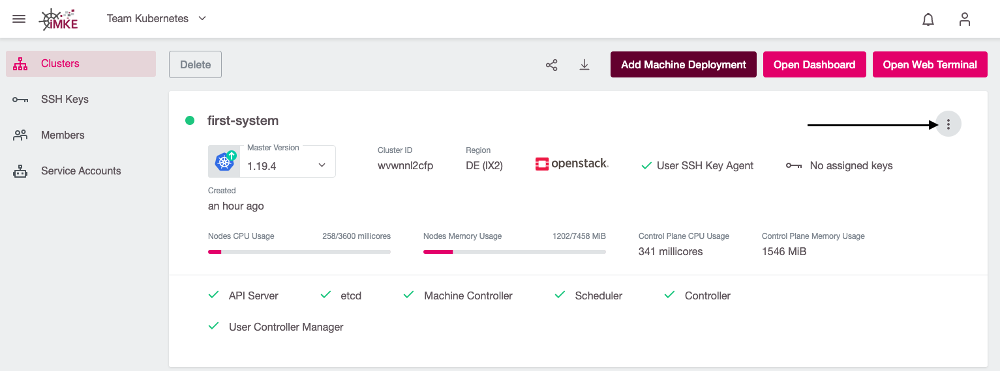
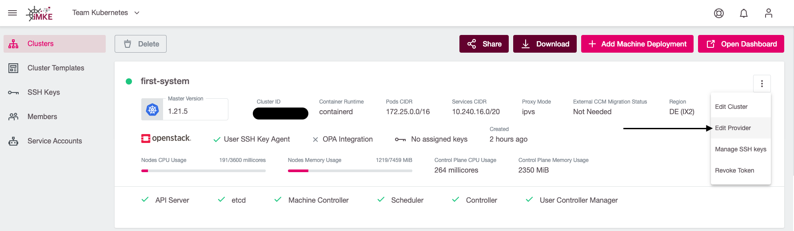
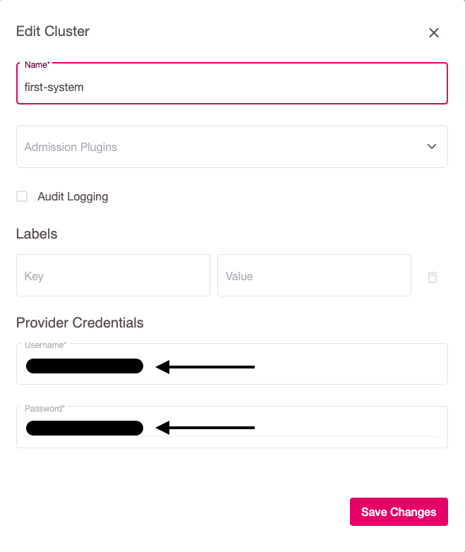

It is possible to change the Credential, that iMKE is using to create Openstack Resources.
This could be needed after changing the Password, or we need to use a different account.

## Change the Credentials

Changing the Credentials is as easy as following these steps:

1. Navigate to the desired cluster.

    

2. Click the three dots, to open the cluster sub menu

    

3. Select `Edit Cluster`

    

4. Change Credentials
    

Soon after performing these steps, a confirmation message pops up, and the Credentials changes successfully.
