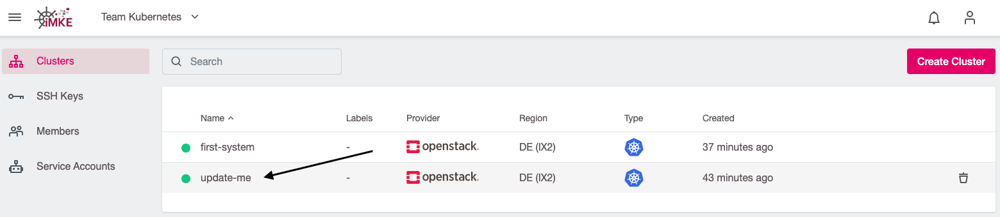
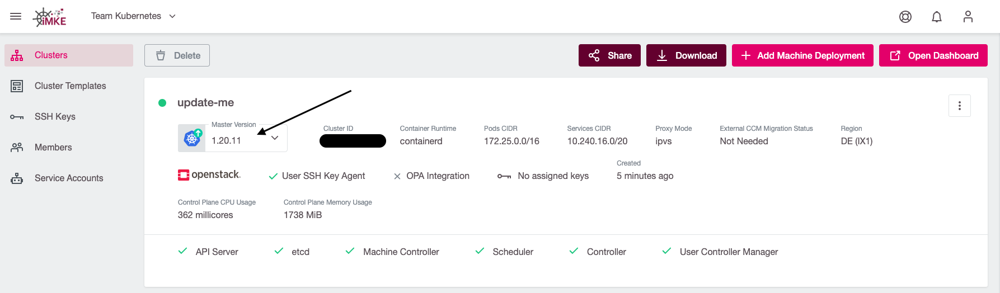
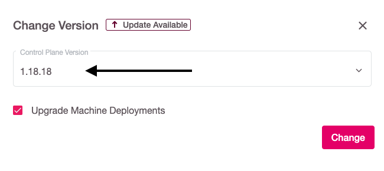
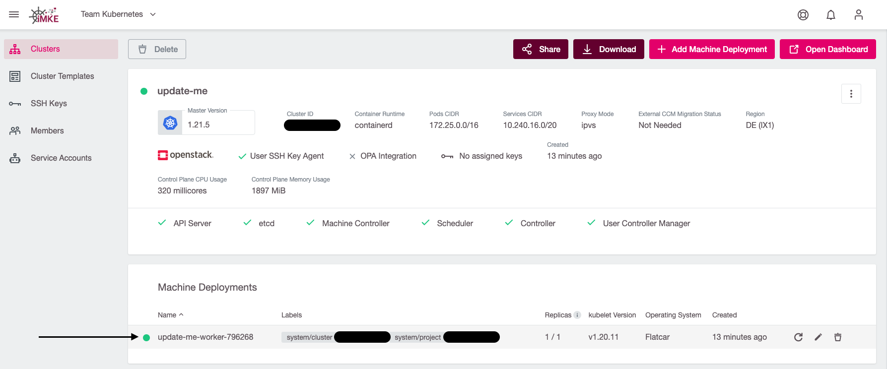
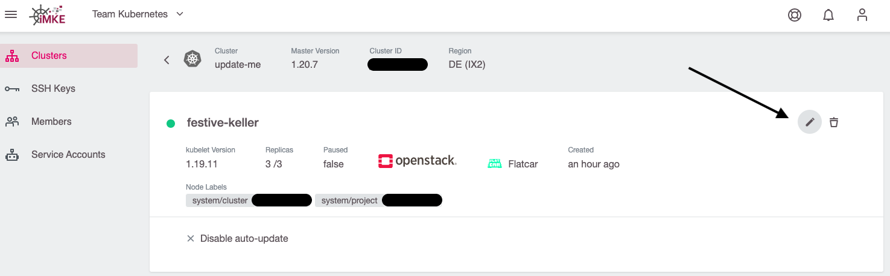
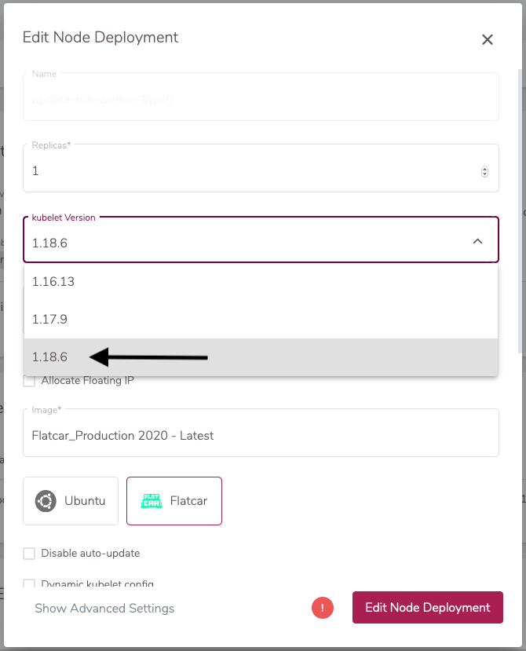

Sicherheit des Clusters steht an erster Stelle, hinzu
kommen noch einige neue Features mit jedem Release. Um
hier auf der sicheren und modernen Seite zu sein empfiehlt
es sich regelmäßig Kubernetes-Updates zu installieren.

In besonders kritischen Fällen updaten wir die Cluster API
automatisch auf die letzte Minor-Version, um auch unsere eigene
Infrastruktur sicher zu halten. In diesem Fall kann der nächste
Block übersprungen werden. Nodes müssen dann nämlich dennoch
selbst geupdated werden.

Bevor Sie einen Cluster upgraden, lesen Sie bitte das [Changelog](/imke/about/) der Ziel-Kubernetes-Version,
und stellen Sie sicher, dass Sie sich mit den bevorstehenden Änderungen vertraut machen.

Das Tool [Kubepug](https://github.com/rikatz/kubepug) kann bei der Vorbereitung eines Updates helfen.
Es kann die Kompatibilität der benutzten Ressourcen zur neuen Kubernetes-Version überprüfen und vor deprecated oder nicht mehr unterstützten Versionen warnen.

## Der Cluster

In Kubernetes teilt sich die Infrastruktur in Master (= Kubernetes Controlplane) und (Worker-)Nodes.
Bei iMKE Clustern werden die Master verwaltet.

Da mehrere Versionen für die Master angeboten werden, hat man
hier im Webinterface von iMKE die Wahl der Version offen. Ein
Update der Master ist mit ein paar Mausklicks erledigt.

Als Erstes gehen wir in den Cluster, den wir updaten wollen.



Nun klicken wir in das Feld `Master Version` und wählen eine
neue Version für die Master.



Wir empfehlen, dabei direkt `Upgrade Machine Deployments` zu aktivieren, um die Worker-Nodes im gleichen Schritt mit zu upgraden:



Jetzt aktualisiert iMKE die Master (und ggf. auch die Nodes) selbstständig und wir sind mit
diesem Schritt fertig.

## Die Nodes

Sofern der Master ohne Machine Deployments aktualisiert wurde oder ein Upgrade der iMKE-Plattform selbst zu einem impliziten Upgrade des Master geführt hat (i.d.R. nur Patchlevel), müssen wir nun noch manuell die Nodes aktualisieren. Auch hier hilft uns das iMKE Webinterface.

Es ist jedoch zu beachten, dass bei einem Update neue Nodes erzeugt
und die alten Nodes gelöscht werden. Dabei werden zwangsweise auch
alle Pods neu gestartet.

Als ersten Schritt klicken wir nun auf das Machine Deployment.



Nun clicken wir auf dem Bleistift Symbole, um die Update-Ansicht
aufzumachen.



Bei kubelet Version wählen wir nun die Version aus, welche auch bei
unserem Cluster Master konfiguriert ist. In diesem Beispiel
`1.21.5` und bestätigen mit `Save Changes`:



Nun wird iMKE automatisch die Node Group auf die neue Version
aktualisieren und Kubernetes dafür sorgen, dass unsere Applikationen
neu auf die neuen aktualisierten Nodes verteilt werden.

## Zwei Node Cluster

Aufzupassen ist hier mit Clustern mit zwei Nodes. iMKE nutzt ein
rollierendes Update als Strategie für das Update. Hierbei wird immer
ein Node nach dem anderen getauscht. Bei einem Cluster mit zwei oder
weniger Nodes bedeutet dies, dass der zuerst geupdatete Node komplett
voll geplant wird, noch bevor der zweite fertig ist.

Als Lösung gibt es ein recht einfaches Bash-Script, welches in einem
Namespace alle Pods noch einmal neu erstellen lässt:
<https://github.com/truongnh1992/playing-with-istio/blob/master/upgrade-sidecar.sh>

Dieses nutzen wir, sobald das Cluster komplett geupdated ist im
WebTerminal.

```bash
curl -o upgrade-node.sh https://raw.githubusercontent.com/truongnh1992/playing-with-istio/master/upgrade-sidecar.sh
chmod +x upgrade-node.sh
echo -e "#\!/bin/bash\n$(cat upgrade-node.sh)" > upgrade-node.sh
```

Nun müssen wir nur noch dieses Script auf alle unsere Namespaces anwenden.

```bash
kubectl get namespace
NAME              STATUS   AGE
default           Active   36m
kube-node-lease   Active   36m
kube-public       Active   36m
kube-system       Active   36m
webterminal       Active   4m42s

# Wir interessieren uns für default Namespace:
./upgrade-node.sh default

Refreshing pods in all Deployments
```

Nun sind auch alle Pods sauber neu auf unsere Nodes verteilt worden.
