Diese Anleitung beschreibt, wie Sie ihr erstes iMKE-Projekt inkl. einem ersten
Kubernetes-Cluster erzeugen, wie Sie auf das Cluster zugreifen und anschließend
die angelegten Ressourcen wieder vollständig löschen.

## Das erste Projekt anlegen

Nach dem Login in iMKE erscheint folgendes Fenster, in dem wir auf
`Add Project` klicken müssen.
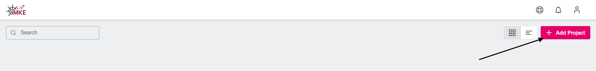

Danach öffnet sich ein Fenster, in dem wir dem Projekt einen Namen geben.
Als Beispiel verwenden wir hier `Team Kubernetes`.
Im zweiten Schritt muss dann auf `Save` geklickt werden.


Im Anschluss legt iMKE das Projekt an und stellt es in der Übersicht dar.
Mit einem Klick auf den Eintrag `Team Kubernetes` sind wir
im Projekt-Umfeld und können das Cluster anlegen.
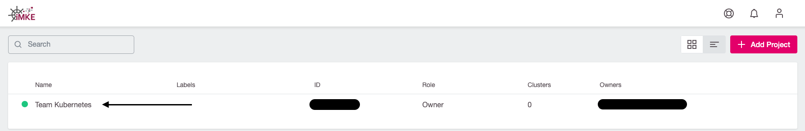

Die folgende Seite zeigt das Projekt. Hier sind alle bereits
bestehenden Cluster sowie zugehörige User und weitere Kontroll-Mechanismen
sichtbar.
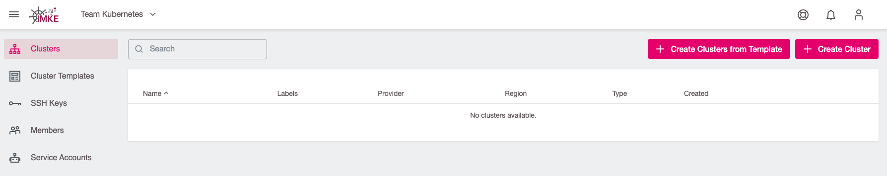

Im Augenblick ist diese Liste noch leer, bis wir unser erstes Kubernetes
Cluster erstellt haben.

## Das erste Cluster erstellen

Um einen Cluster anzulegen, klicken wir im gewünschten Projekt oben rechts auf `Create Cluster`.
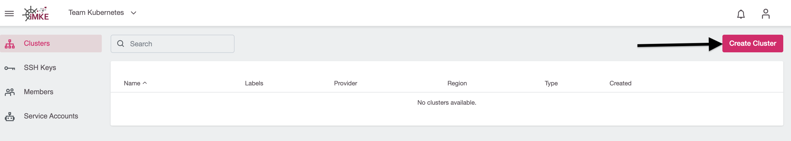

Jetzt öffnet sich die erste Seite für den Prozess, einen Cluster anzulegen.
Dazu wählen wir den Provider `openstack` und eine der drei Verfügbarkeitszonen aus, in diesem Beispiel
nehmen wir `IX2`:
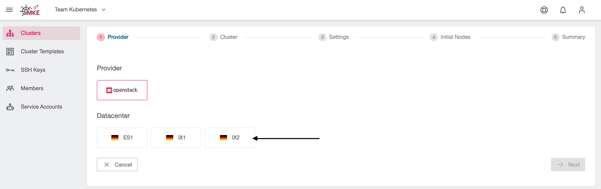

Im nächsten Schritt konfigurieren wir die Cluster-Details. In unserem Beispiel nennen wir das Cluster `first-system` und
wählen die gewünschte Kubernetes-Version aus:
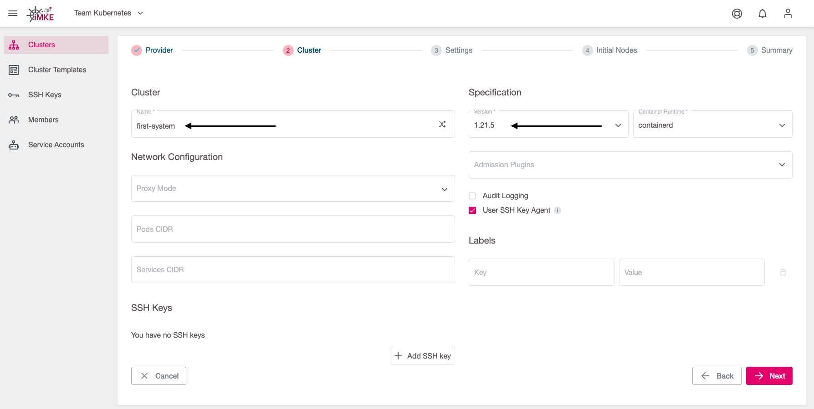

Für den gelegentlichen SSH-Zugriff auf Worker-Nodes können wir optional einen öffentlichen SSH-Schlüssel hinterlegen.
Zum Hinzufügen eines SSH-Keys klicken wir auf `Add SSH Key`:
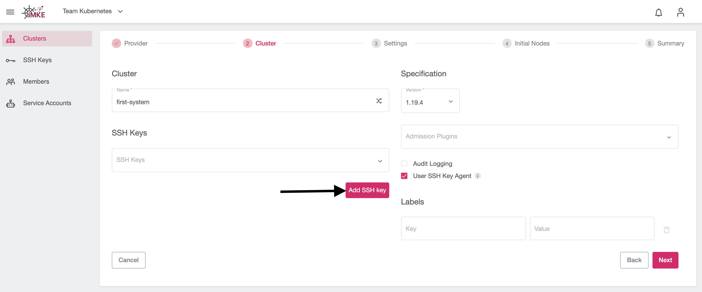

In dem sich öffnenden Dialog können wir dann unseren SSH Public Key eintragen
und ihm einen passenden Namen geben:


Damit iMKE in der OpenStack-Infrastruktur die notwendigen Ressourcen erzeugen kann,
geben wir im nächsten Schritt unsere Zugangsdaten ein. Danach wird der Inhalt im Feld `Project`
automatisch aktualisiert und wir können in der Dropdownliste unser gewünschtes OpenStack Projekt
auswählen:
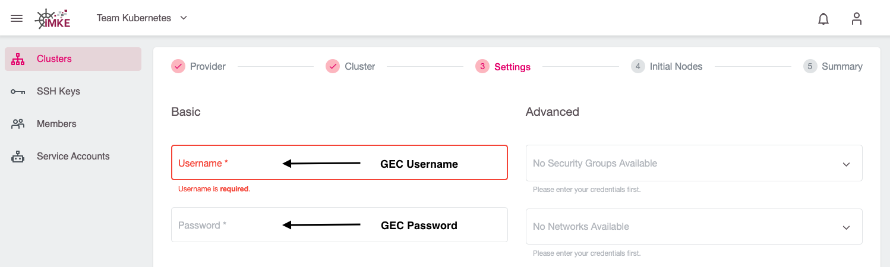
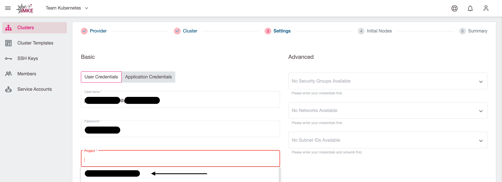

Mit dem Hinzufügen der Credentials und dem Auswählen des OpenStack-Projekts sind alle
notwendigen Eingaben getätigt, so dass wir mit dem nächsten Schritt fortfahren können. Wenn wir das tun,
wird automatisch ein eigenes Netzwerk, Subnet sowie eine Security Gruppe für das neue Cluster erstellt.

Es ist allerdings auch möglich, ein existierendes Netzwerk verwenden, um den Cluster zu erstellen.
Dazu müssen wir das Netzwerk und das Subnetz auswählen. Diese müssen allerdings mit einem Router verbunden sein.
In unserer [OpenStack Dokumentation](/optimist/guided_tour/step10/) ist beschrieben, wie man einen Router erstellen 
und mit einem Netzwerk verbinden kann.
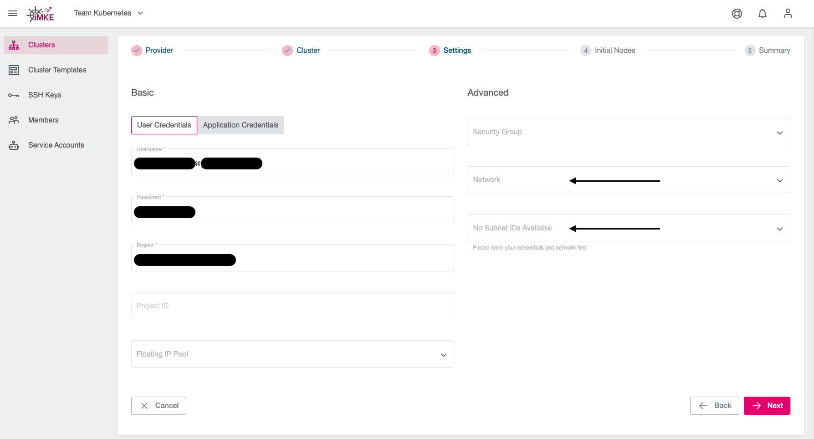

Im nächsten Schritt definieren wir, wie viele und welche virtuellen Maschinen als Worker-Nodes im Cluster verfügbar
sein sollen.

Zuerst geben wir dem sogenannten `Machine Deployment` einen Namen. Für unser Testcluster nutzen wir dazu den Namensgenerator:
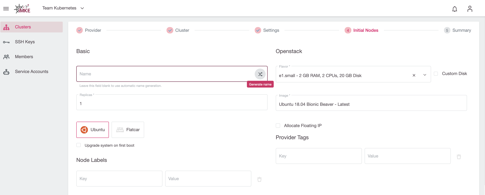

Danach spezifizieren wir die `Replicas` (Anzahl der Worker-Nodes im Kubernetes-Cluster) und den `Flavor` (den Maschinentyp), welcher
im Wesentlichen die Anzahl der verfügbaren CPU-Kerne und des RAMs bestimmt:
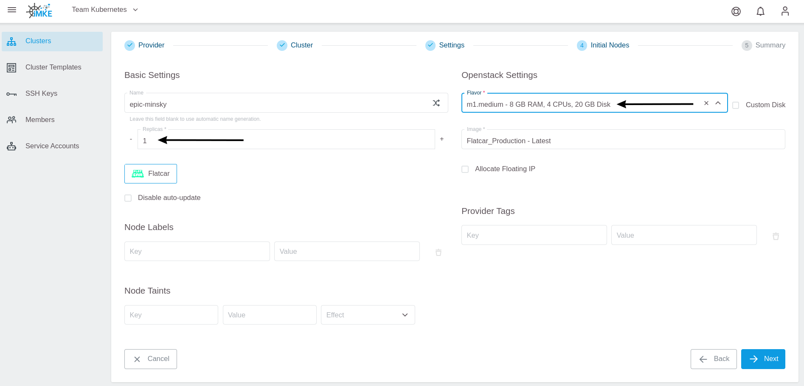

Weiterhin wählen wir `Flatcar` als Betriebssystem für die Worker-Nodes:
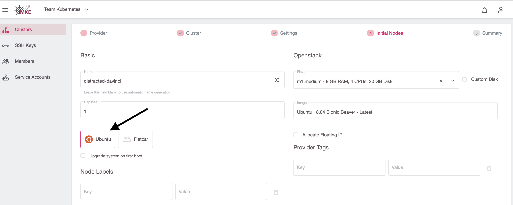

Über einen Klick auf `Next` gelangen wir zum letzten Schritt, wo wir noch einmal alle Einstellungen verifizieren und mittels `Create Cluster`
die Cluster-Erstellung starten können:


Nun wird das Cluster erstellt. Um auf die Informationen zugreifen zu können müssen
wir nun wieder auf die Cluster-Übersicht des Projektes und dort unser Cluster auswählen:
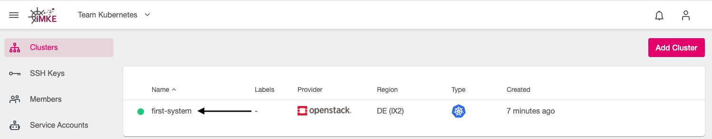

Nach der Auswahl unseres Cluster kommen wir nun auf die Seite mit allen Cluster-Details:
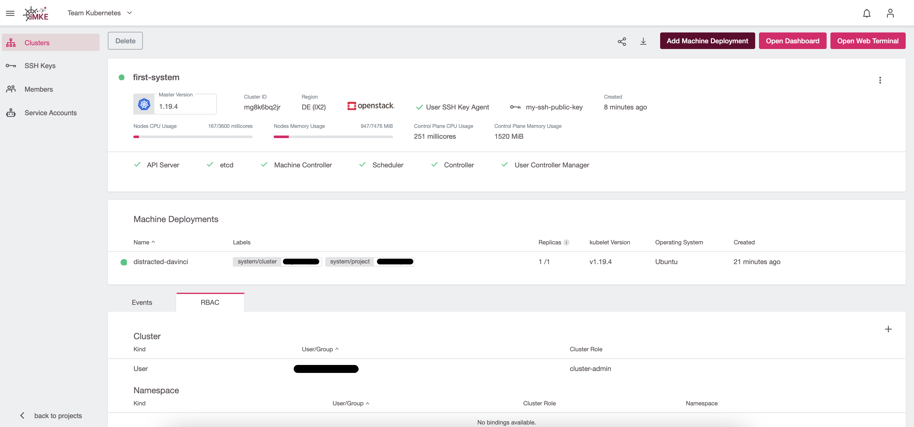

## Auf das Cluster zugreifen

Um auf das Cluster zuzugreifen, klicken wir oben rechts
auf den nach unten gerichteten Pfeil:
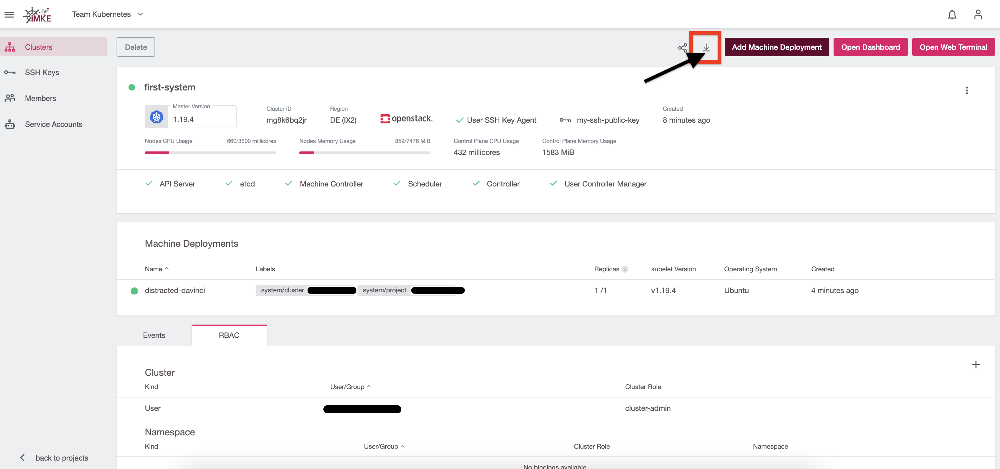

Damit laden wir eine Datei herunter, die sich im Kubernetes-Jargon
`kubeconfig` nennt. In dieser Datei stehen alle Endpunkte,
Zertifikate sowie Bereiche des Clusters. Mit dieser Datei ist
`kubectl`  in der Lage, sich mit dem Cluster zu verbinden.

Um diese Datei zu nutzen, müssen wir sie auf der Konsole
registrieren. Dafür gibt es zwei Möglichkeiten:

1. `kubectl` schaut als Standard in die Datei `.kube/config`
    im Heimat-Verzeichnis des Benutzers.
2. Wir können die `kubeconfig` temporär mittels einer Umgebungsvariable
    exportieren.

Der Einfachheit halber und um auf unserem System die Standards
nicht zu verändern, gehen wir hier mit Variante 2.

Dafür benutzen wir eine Konsole. In den Screenshots verwenden
wir iTerm2 auf macOS, es funktioniert jedoch auf Linux und Windows
bash genau so.

Als Erstes müssen wir die heruntergeladene Datei finden.
Chrome und Firefox laden diese beide normalerweise in den Downloads
Ordner. Der Dateiname setzt sich jetzt aus zwei Komponenten zusammen:

* `kubeconfig-admin-`
* unser Cluster ID

Um diese dann zu registrieren, nutzen wir folgendes Kommando:

```bash
cd Downloads
export KUBECONFIG=$(pwd)/kubeconfig-admin-CLUSTERID
```

Nun können wir mit unserem Cluster reden. Das einfachste Kommando ist
hier: "zeige mir alle Nodes meines Clusters":

```bash
kubectl get nodes

NAME                           STATUS   ROLES    AGE   VERSION
musing-kalam-XXXXXXXXX-ks4xz   Ready    <none>   10m   v1.15.0
musing-kalam-XXXXXXXXX-txc4w   Ready    <none>   10m   v1.15.0
musing-kalam-XXXXXXXXX-vc4g2   Ready    <none>   10m   v1.15.0
```

## Aufräumen

Um nach diesem ersten Test das Cluster wieder zu löschen, klicken wir auf `Delete`:
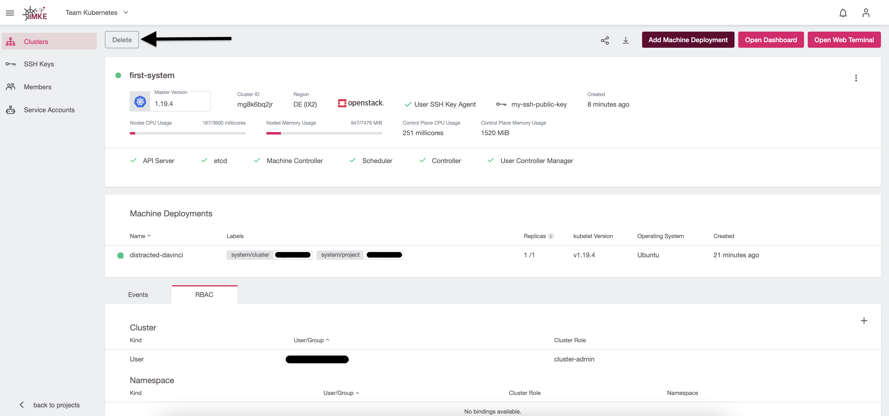

In dem sich öffnenden Fenster wird als Sicherheitsfrage
der Cluster-Name angefragt:
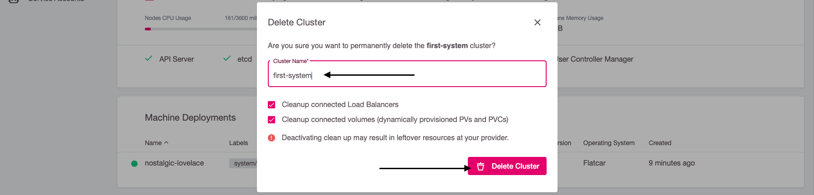

Da wir alles löschen wollen, lassen wir die beiden Checkboxen
angehakt. Damit werden auch Volumes und LoadBalancer in
OpenStack gelöscht.
