<!-- LTeX:  language=de-DE -->

Die iMKE-Plattform bietet die Möglichkeit, einen SSH-Key auf Worker-Nodes zu installieren. Dies kann zum Beispiel hilfreich sein, wenn man den Cluster oder eine eigene Applikation unmittelbar auf den Worker Nodes debuggen möchte.

Dafür benötigt man folgende Schritte:

- Man muss einen SSH-Key erstellen,
- Das Cluster muss den `User SSH Key Agent` aktiviert haben,
- Man muss den SSH-Key zum Projekt hinzufügen und
- Ihn schließlich im Cluster aktivieren.

In der Regel muss weiterhin den Worker-Nodes noch eine Floating IP zugewiesen werden, damit der Zugriff auf die Worker-Nodes auch netzwerkseitig funktioniert.

## User SSH Key Agent

Um SSH-Keys verwalten zu können, muss der `User SSH Key Agent` im Rahmen der Erstellung des Clusters aktiviert worden sein:

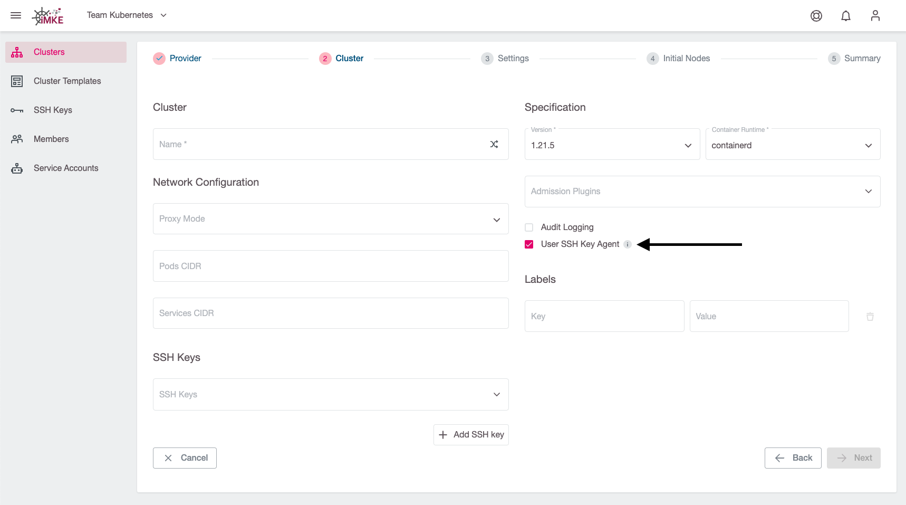

Ist der Agent nicht bei der Erstellung des Clusters aktiviert worden, können nachträglich keine SSH-Keys zum Cluster hinzugefügt bzw. geändert werden. Weiterhin kann auch der User Key SSH Agent nur während der Erstellung des Clusters aktiviert werden, eine nachträgliche Aktivierung ist nicht möglich.

### Den Status des User SSH Key Agents überprüfen

Der aktuelle Status des User Key SSH Agents kann auf der Übersichtsseite des Clusters eingesehen werden. Hierzu muss erst die erweiterte Clusteransicht aufgeklappt werden damit diese Information sichtbar wird:

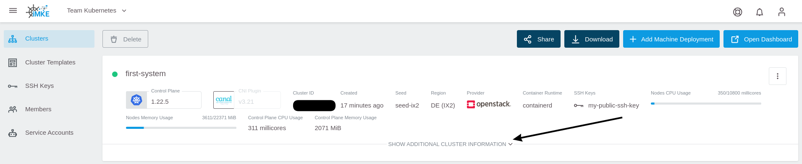

Nun kann man im unteren Abschnitt den Status des User Key SSH Agents ablesen:

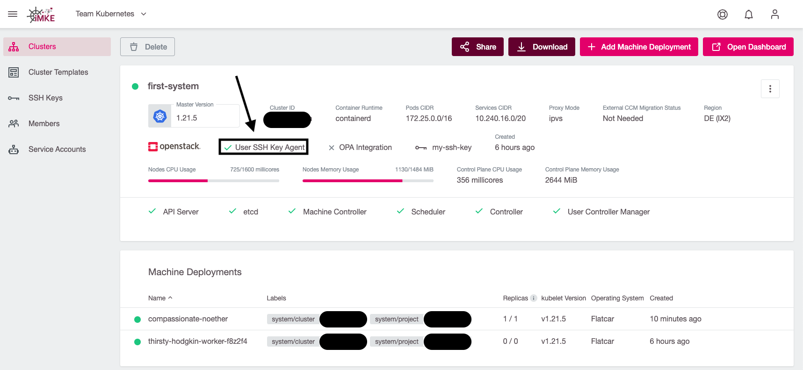

Wenn der Agent aktiviert ist, können jederzeit SSH-Keys zum Cluster hinzugefügt bzw. geändert werden.

### Alternativen zur Verwendung des User SSH Agents

Cluster können auch **ohne** aktivierten User Key SSH Agent angelegt werden. In diesem Fall wird während der gesamten Lebenszeit des Clusters jede neue Worker-Node ohne SSH-Keys erstellt - eine Änderung dieser Eigenschaft ist auch nachträglich nicht möglich. Dies erlaubt es beispielsweise, die SSH-Keys der Worker-Nodes mit anderen Tools wie Saltstack, Puppet oder Chef zu verwalten, wenn beispielsweise Worker-Nodes mit einem eigenen Image erstellt werden, die diese Konfiguration mitbringen. Es ist nicht möglich, den User Key SSH Agent nachträglich zu aktivieren, um solche Setups nicht negativ in ihrer Funktion zu beeinflussen.

## Einen SSH-Key zu einem bestehenden Cluster hinzufügen

Die folgenden Schritte beschreiben, wie man einen SSH-Key zu einem bestehenden Cluster hinzufügen kann, welches den User SSH Key Agent aktiviert hat.

### Einen SSH-Key erstellen

Ein Schlüsselpaar kann man am einfachsten mit dem Tool `ssh-keygen` erzeugen:

```bash
ssh-keygen
```

Die erzeugten Schlüssel (öffentlich und privat) werden standardmäßig in `.ssh/id_rsa.pub` abgelegt.

### Den SSH Key dem Projekt hinzufügen

1. Zuerst muss das richtige Projekt ausgewählt werden:

    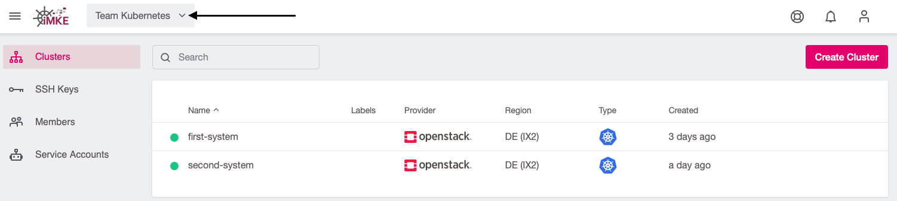

2. Danach zur SSH-Key-Seite gehen:

    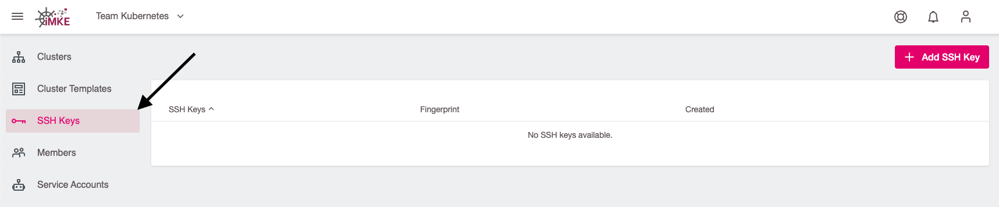

3. Dort benutzen Sie bitte die "Add SSH Key"-Schaltfläche:

    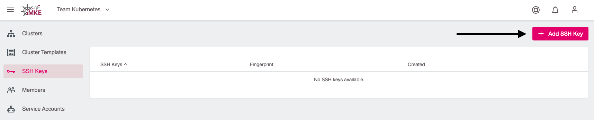

4. Zur leichteren Identifikation geben Sie dem Key bitte einen Namen und fügen Sie den öffentlichen (nicht den privaten!)
   Schlüssel in das dafür vorgesehene Feld ein:

    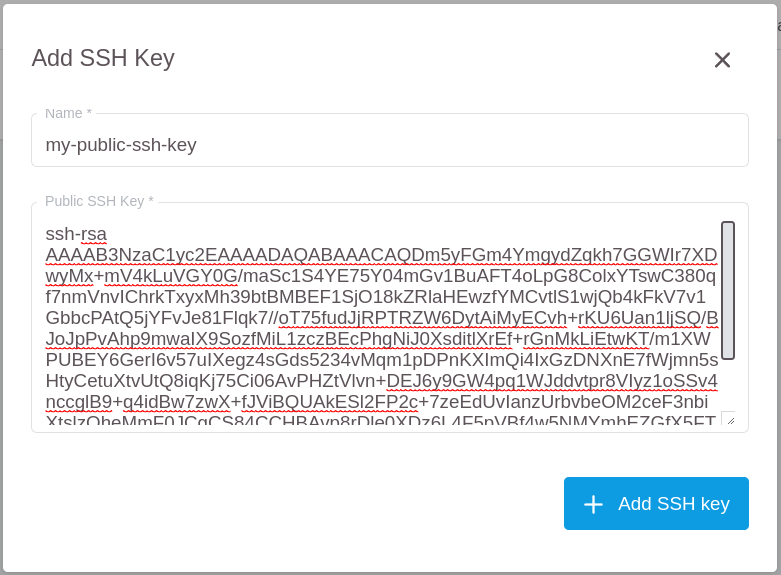

Jetzt kann man den Key in jeden Cluster des Projekts benutzen.
Dies gilt auch für die Erstellung eines neuen Clusters im gleichen Projekt.

### Den SSH Key einem Cluster hinzufügen

1. Cluster auswählen:

    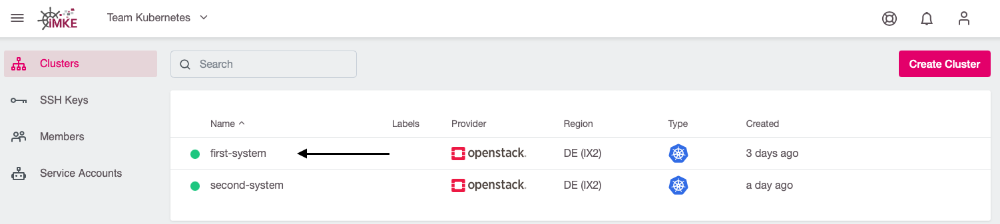

2. Um das Cluster-Menü zu öffnen, bitte auf die drei Punkte klicken:

    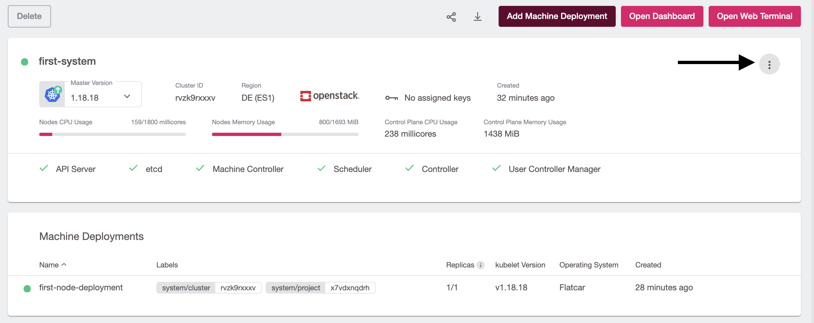

3. Aus dem Menü bitte `Manage SSH keys` wählen:

    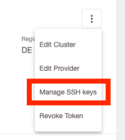

4. Nun kann der eben erstellte SSH-Key aus einer Dropdown Liste ausgewählt werden.

    

5. Nach der Auswahl wird der Key in der Liste angezeigt und kann dort bei Bedarf auch wieder gelöscht werden.

    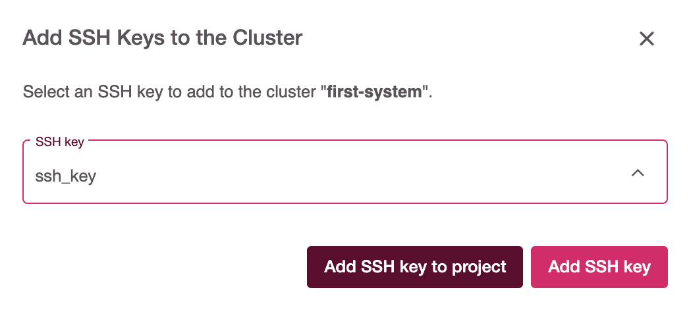

Dein Key wird nun allen Worker-Nodes in allen Machinedeployments hinzugefügt.

## Einen SSH-Key während der Cluster-Erstellung hinzufügen

Es ist auch möglich, einen SSH-Key bereits zum Zeitpunkt der Cluster Erstellung zu konfigurieren. Das genaue Vorgehen dazu ist im Abschnitt "[Einen Cluster anlegen](/imke/clusterlifecycle/creatingacluster/)" beschrieben.

## Am Worker anmelden

Sobald der bzw. die SSH-Keys zum Cluster hinzugefügt wurden, muss den Worker-Nodes noch eine öffentliche (Floating) IP zugewiesen werden, damit diese netzwerkseitig erreichbar sind.

Dazu Editieren Sie die Machinedeployments:

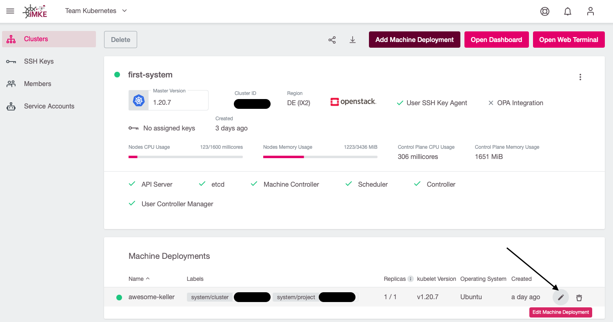

Dort sollten Sie sicherstellen, dass `Allocate Floating IP` aktiviert ist:

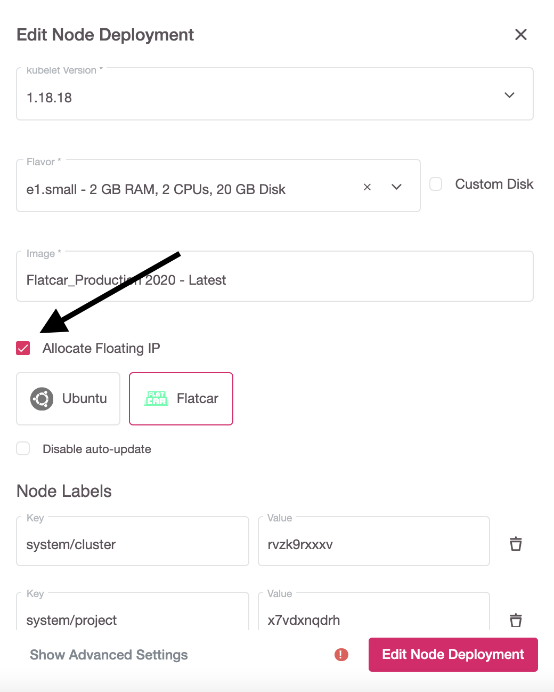

Wenn sich hier ein Setting ändert, werden alle Worker neu erstellt. Danach kann man sich per SSH einloggen.

Der Standarduser für Flatcar heisst `core`.

```bash
 ssh -A core@PUBLIC_IP
```
