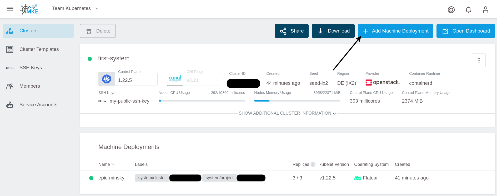
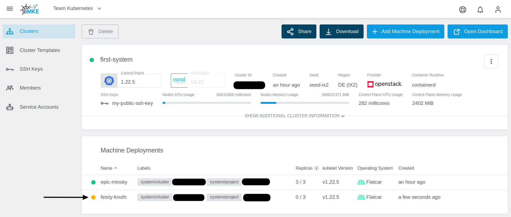
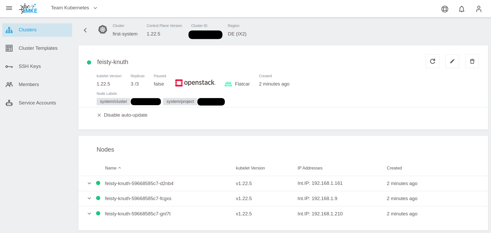

<!-- LTeX:  language=de-DE -->

# Machine Deployment hinzufügen

Um ein Machine Deployment hinzuzufügen, `Add Machine Deployment` Button in der oberen rechten Ecke klicken.

Das öffnet den `Add Machine Deployment` Dialog:

Zum Speichern `Add Machine Deployment` klicken:

Die neuen Nodes werden jetzt angelegt. Den aktuellen Status bekommt man in den Machine Deployment Details.

Das neue Machine Deployment auswählen:

…und warten bis alle Nodes Grün sind:

# Machine Deployments löschen

Um ein Machine Deployment zu löschen, kann man das Löschsymbol in der Machine Deployment Liste nehmen:

…oder auf der Detailseite:

# Machine Deployments umbenennen

Machine Deployments können nicht umbenannt werden.

Es sollte ein neues Machine Deployment [angelegt](#machine-deployment-hinzufügen) werden und anschließend das alte [gelöscht](#machine-deployments-löschen) werden.

Dabei kann es aber, je nach Replica Einstellung und Anzahl der Nodes, zu kurzen Ausfällen kommen.

Sicherer ist es, wenn man das alte Machine Deployment langsam reduziert - 1 Replica nach dem anderen – bis keine Node mehr übrig ist und dann erst löscht. Bei der Prozedur kann es passieren das Pods nicht nur auf die neuen Nodes umgezogen werden, sondern auch auf noch aktive alten. Dann wird ein Pod ggf. mehrfach umgezogen. Das kann man umgehen, indem man vor dem Reduzieren erst alle alten Nodes mit `kubectl cordon <node name>` aus dem Scheduler entfernt.
