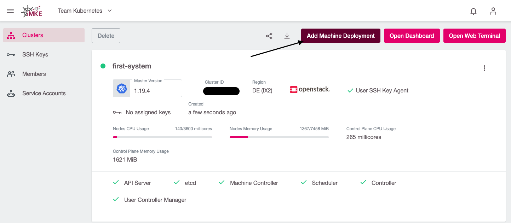
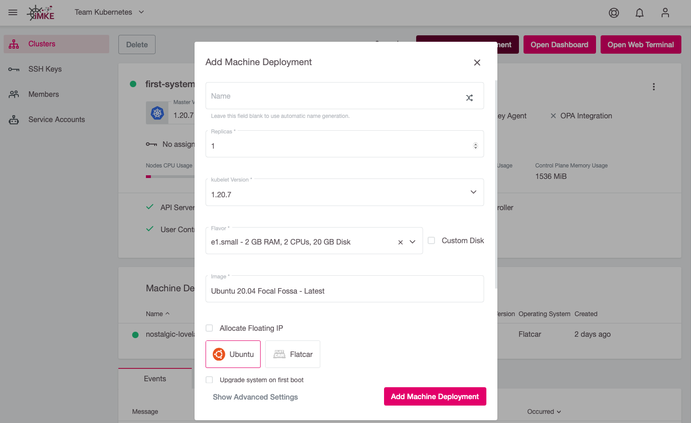
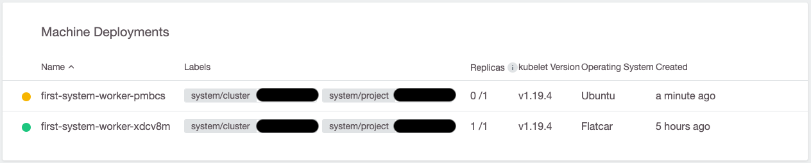
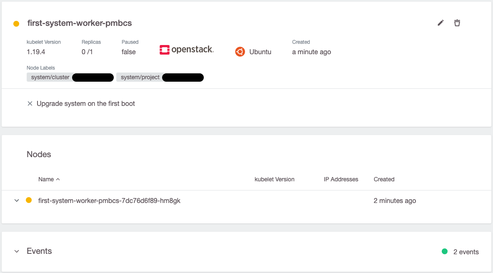
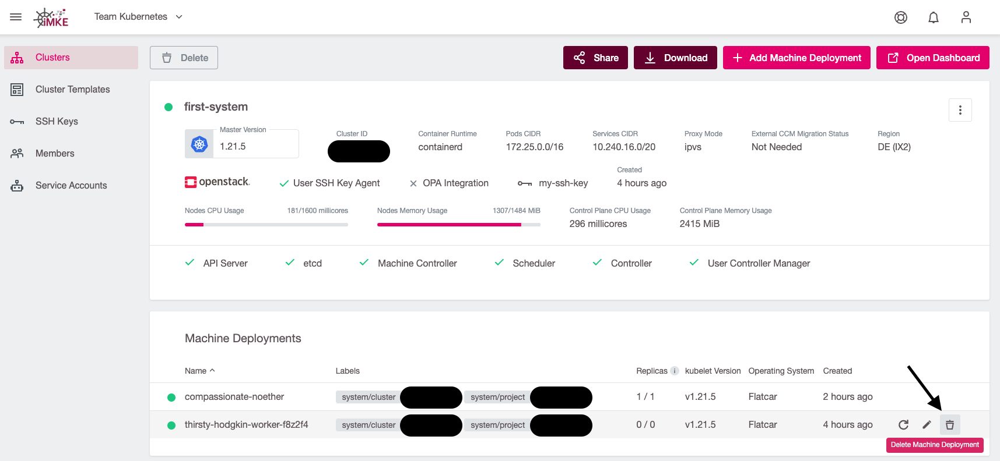
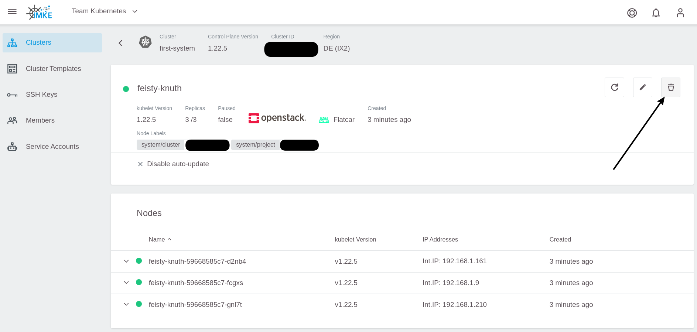

# Add Machine Deployment

To add a new Machine Deployment, use the `Add Machine Deployment` Button in the right top corner.

This brings up the `Add Machine Deployment`-dialog, which has the same options as at cluster creation time:

After pressing `Add Machine Deployment`:

the new nodes will be created. You can look at the progress in the Machine Deployment details.

Click on the new Machine Deployment:

and wait until all nodes are green.

# Delete Machine Deployment

To delete a Machine Deployment use the trash symbol in either the list:

or the details page:

# Rename Machine Deployment

Machine Deployment can't be renamed. So we need to [create](#add-node-deployment) a second one and [delete](#delete-node-deployment) the old one.

But there is a Gotcha! Deleting a Machine Deployment will delete all nodes at the same time. Depending on our replicas and number of nodes, that can lead to a downtime.

To mitigate this, you should reduce the replica of the Machine Deployment step by step until it is 0 and then delete the Machine Deployment.

The Pods will most likely rescheduled to the new host directly, but it is possible that some pod will end up on old nodes. This will lead to many rescheduled. If that is a problem, it is possible to first cordon all old nodes with `kubectl cordon <node name>` and then slowly reduce the replicas afterwards.
