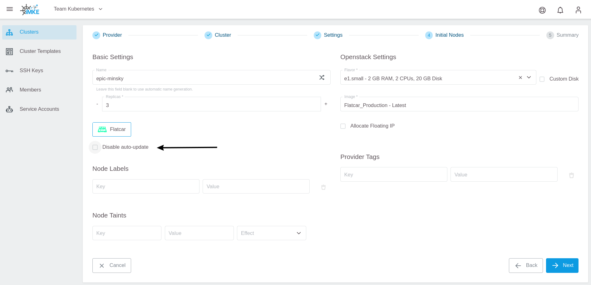
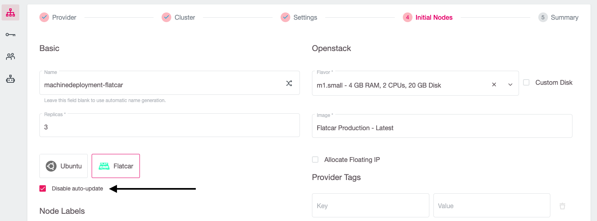
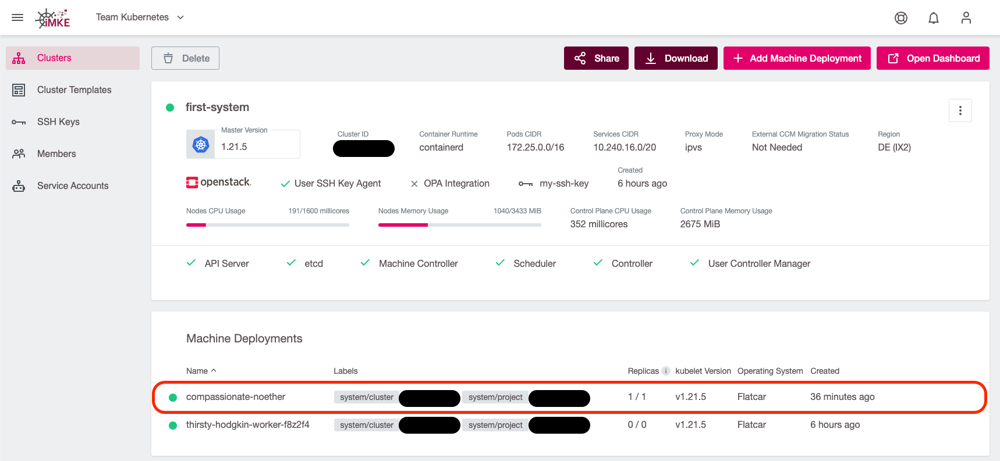
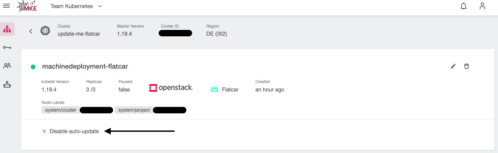
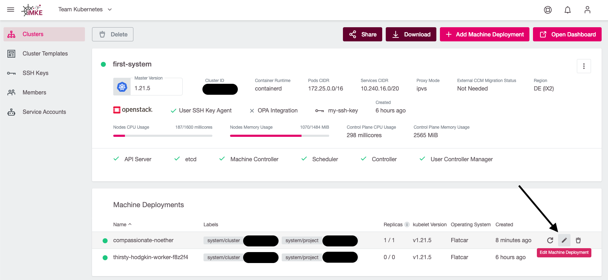
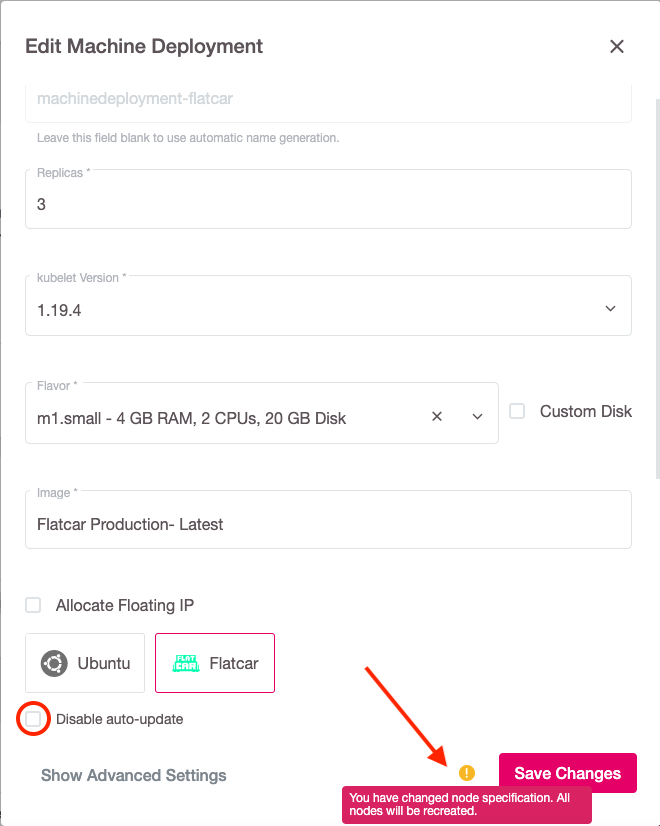

The iMKE platform gives you the control over choosing the OS of worker nodes in your Kubernetes clusters via the `Machine Deployment`.

* For Flatcar, the iMKE platform even takes care (if not explicitly deactivated) of regular operating system updates, such as installing security patches.
* The Ubuntu-based worker nodes require manual actions by the cluster owners to receive updates.

## Update Flatcar worker nodes automatically

iMKE provides the functionality to keep the operating system of Flatcar based worker nodes up to date.
This feature will automatically install any updates released by the upstream vendor (Kinvolk) for Flatcar
on the worker nodes.

The auto-update feature uses [FLUO](https://github.com/kinvolk/flatcar-linux-update-operator), the Flatcar Linux Update Operator in the background.
When a reboot is needed after updating the system, it will drain the node before rebooting it. It coordinates the reboots of multiple nodes in the cluster,
ensuring that only one node is rebooting at once.

Using the auto-update functionality is enabled by default. The following screenshot shows the creation of a machine deployment with auto-updater enabled:

If you would like to take care of OS updates (and the reboots) yourself, it is possible to disable the automatic updates of the worker nodes by selecting the `Disable auto-update` checkbox:

> We highly encourage our users to use the auto-update feature to keep your infrastructure safe.

### Checking the state of the auto-updater

To check if your nodes receive automatic OS-updates, click on the machine deployment:

and check if the `Disable auto-update` option has a green checkmark in front of it (auto-updater is off):

or if it's greyed out (auto-updater is on):

### Enabling/disabling auto-updater on an existing machine deployment

To change the status of the auto-updater, click on the edit button of the machine deployment:

and (de)-select the checkbox accordingly:

After clicking on `Save Changes`, all worker nodes will perform a rolling update and reboot.

## Summary

In this guide you've learned the following:

* What the auto-update feature is
* How to enable and disable the auto-update feature for a machine deployment

**Further reading**

* [Auto-Updating Flatcar Container Linux](https://kinvolk.io/docs/lokomotive/git-main/how-to-guides/auto-update-flatcar/)
* [FLUO on Github](https://github.com/kinvolk/flatcar-linux-update-operator)
* [The Flatcar partitioning scheme](https://kinvolk.io/docs/flatcar-container-linux/latest/reference/developer-guides/sdk-disk-partitions/)
