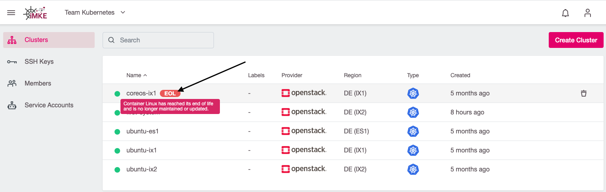
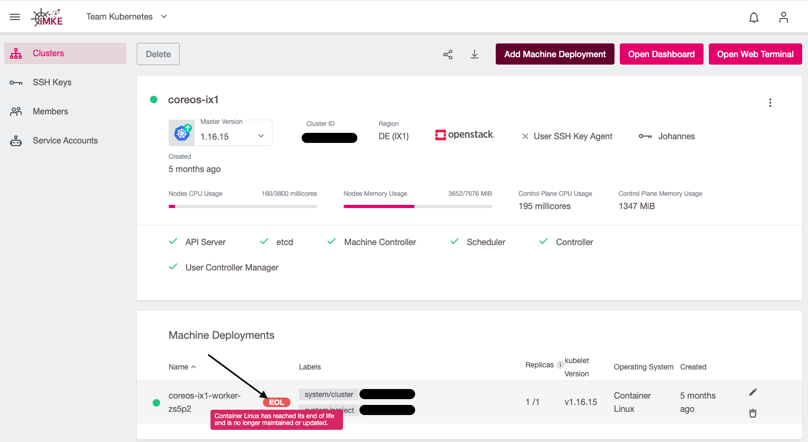
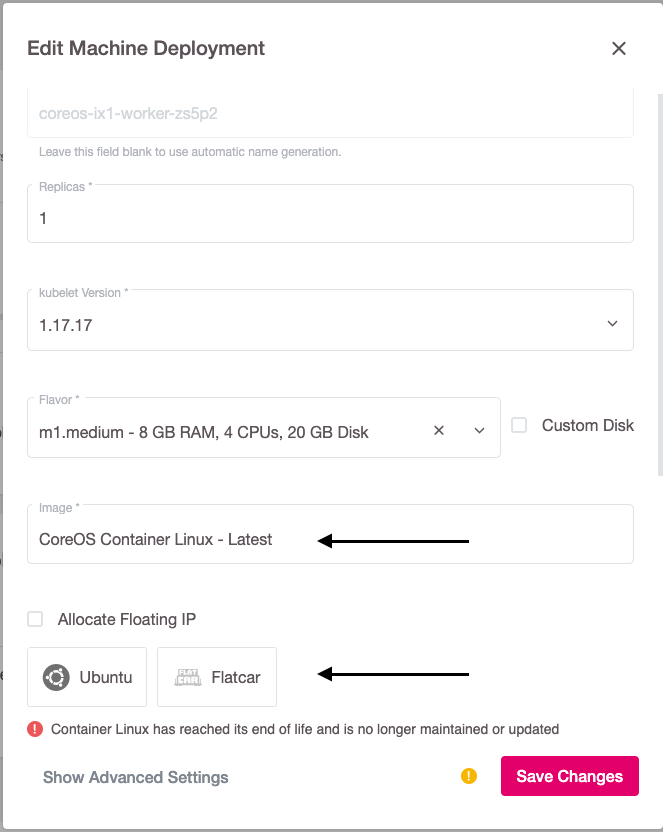
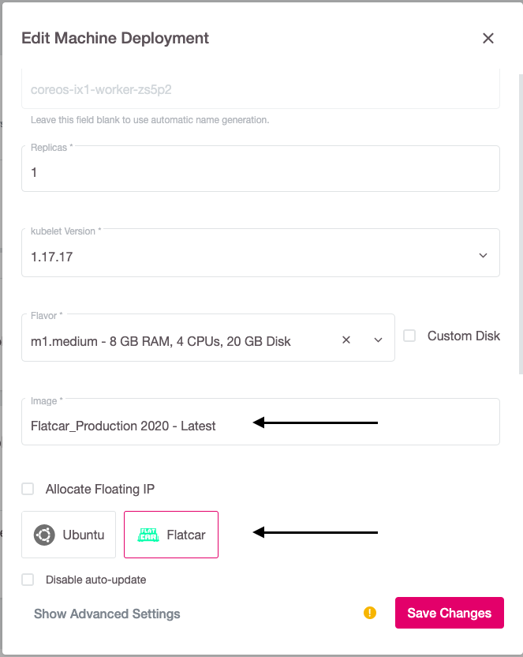

Die iMKE-Plattform erlaubt es Ihnen, das Betriebssystem der Worker-Nodes ihrer Kubernetes-Cluster über das `Machine Deployment`
selbst zu wählen. Die iMKE-Plattform kümmert sich (sofern nicht explizit deaktiviert) um regelmäßige Betriebssystem-Upgrades wie das Anwenden von Sicherheitspatches. Einige Aktionen erfordern jedoch manuelle Aktionen der Clusterbesitzer:

- Betriebssysteme werden "End of Life" und nicht mehr unterstützt
- Wichtige Versions-Upgrades von Betriebssystemen

Da diese Änderungen wenigstens ein rollierendes Upgrade aller Worker-Nodes erfordern, werden sie nicht automatisch ausgeführt, sondern erfordern einen manuellen Eingriff.

## Betriebssystem End-of-Life

Mit der iMKE-Plattform Version 2.14 haben wir die Unterstützung von CoreOS / Container Linux offiziell beendet. Dies liegt darin
begründet, dass diese Linux-Distribution nicht mehr gepflegt wird und wir daher keine Sicherheitspatches mehr zur
Verfügung stellen können. CoreOS wurde in unserer Plattform durch Flatcar Linux ersetzt. Im folgenden Abschnitt beschreiben wir,
wie Sie das Upgrade von CoreOS auf Flatcar durchführen.

### Identifizieren von Clustern mit EOL-Machine Deployments

Cluster mit Machine Deployments mit einem "End-of-Life" Betriebssystem sind mit einem roten Ausrufezeichen gekennzeichnet:

In der Detailansicht des Clusters wird das Ausrufezeichen auch auf dem betroffenen Machine Deployment angezeigt:

Bitte beachten Sie, dass für Betriebssysteme, die noch unterstützt werden, für die jedoch eine neue Haupt-Version verfügbar ist,
kein Ausrufezeichen angezeigt wird. In Wartungsmails werden jedoch neue Versionen angekündigt, und ein frühzeitiges Upgrade wird
von uns explizit empfohlen.

### Ändern eines EOL-Betriebssystems auf Worker-Nodes

Um das Betriebssystem auf den Worker-Nodes zu aktualisieren, müssen Sie mit der Bearbeitung des Machine Deployment beginnen:

Der folgende Bildschirm zeigt ein altes Image ("CoreOS Container Linux - Neueste"), das nicht mehr unterstützt wird (End-of-Life).
Bitte wählen Sie ein unterstütztes Betriebssystem wie Flatcar aus:

Durch Auswahl eines unterstützten Betriebssystems wird auch das Image-Feld aktualisiert:

Nach dem Klicken auf `Save Changes` führen alle Worker-Nodes ein rollierendes Update durch und starten mit dem neuen
Betriebssystem neu.
