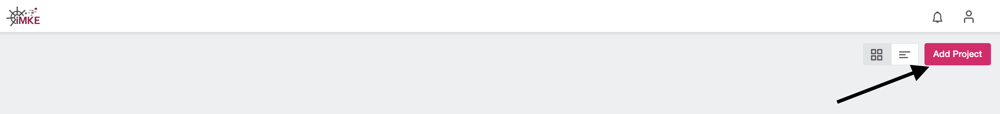
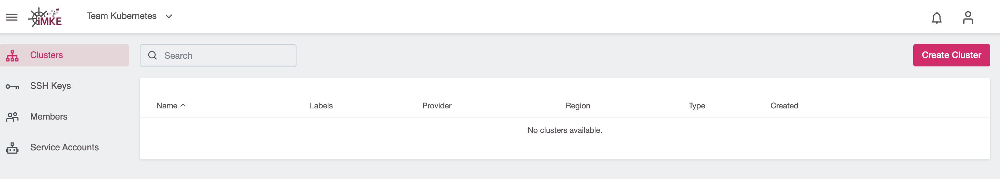

Nach dem Login in iMKE erscheint folgendes Fenster, in dem wir auf
`Add Project` klicken müssen.

Danach öffnet sich ein Fenster, in dem wir dem Projekt einen Namen geben.
Als Beispiel verwenden wir hier `Team Kubernetes`.
Im zweiten Schritt muss dann auf `Save` geklickt werden.

Im Anschluss legt iMKE das Projekt an und stellt es in der Übersicht dar.
Mit einem Klick auf den Eintrag `Team Kubernetes` sind wir
im Projekt-Umfeld und können das Cluster anlegen.

Die folgende Seite stellt das Projekt dar. Hier sind alle bereits
bestehenden Cluster sowie zugehörige User und weitere Kontroll-Mechanismen
sichtbar.

Mit einem Klick auf die Seitenleiste links öffnen wir die Navigation im
Projekt-Umfeld und können die weiteren Bereiche erkunden.

