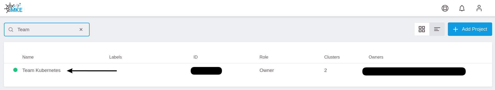
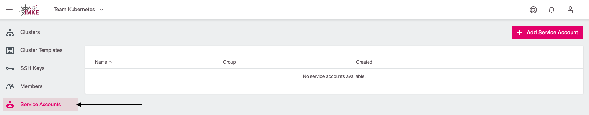
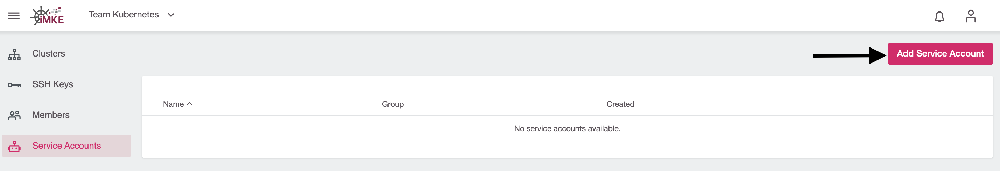
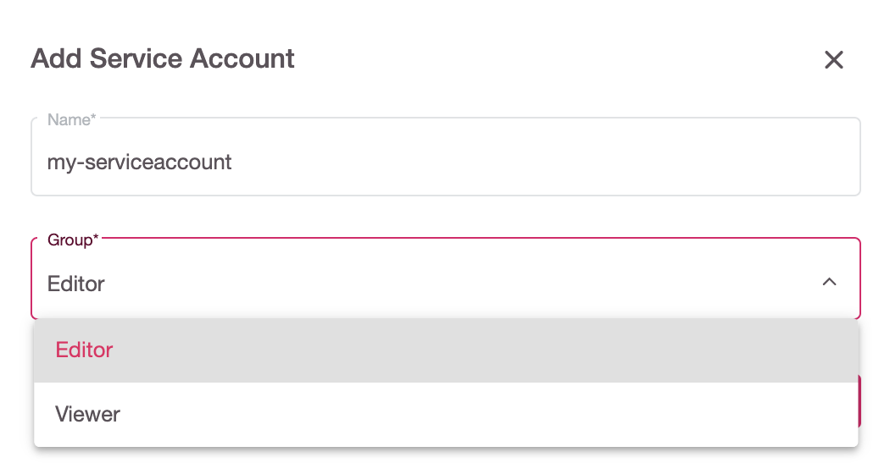
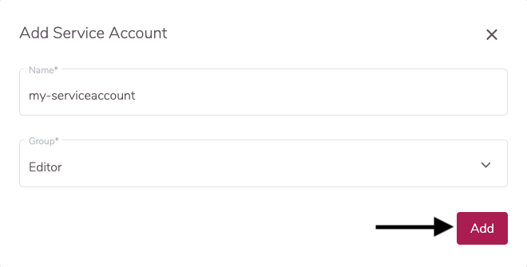
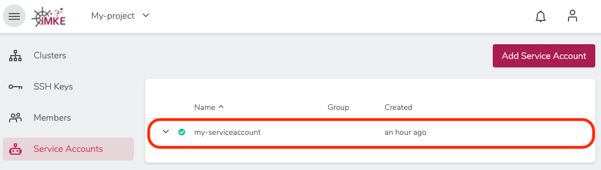
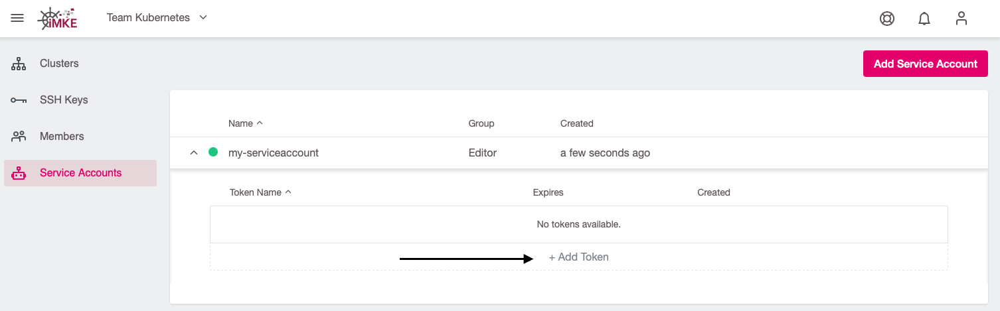
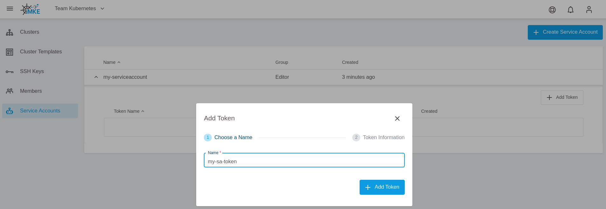
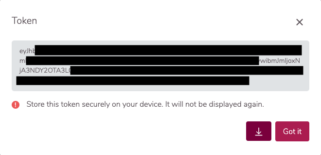

### Service Accounts

Service accounts allow using a long-lived token that you can use to authenticate with the iMKE API.

A service account is a special type of user account that belongs to the iMKE **project**, instead of an individual
end user. Your project resources assume the identity of the service account to call iMKE APIs, so that the users
are not directly involved. A service account can have one or more JWT token(s) which is used to authenticate to the
iMKE API. The JWT token by default expires after 3 years.

## Core Concept

Service accounts are considered a project's resource. Only the owner of the project can create a service account.
There is no need to create a new group for a SA, we want to assign a service account to one of the already defined groups:
`Project Manager`, `Editor` or `Viewer`.

A service account is linked to the project automatically by a `UserProjectBinding` which specifies a binding between a
service account and a project. A service account will be automatically deleted after project removal.

### Creating a Service Account with Token

1. Select the project

    

1. Go to the Service Accounts page

    

1. Use the `Add Service Account` button

    

1. Enter a name for the service account and select the group (either `Project Manager`, `Editor` or `Viewer`)

    

1. Click `Add Service Account`

    

Now the service account has been created. If you want to associate a token to it, do as follows:

1. Select the service account you just created

    

1. Click on `+ Add Token`

    

1. Enter a name for the token and click `Add Token`

    

1. Now the generated token will be shown. Download it using the Arrow icon or copy it.

    

 > **Important note:** Make sure to save this token at a safe place on your own device. It cannot be displayed again after closing the dashboard window.

### Accessing the API via Service Account Token

A client that wants to authenticate itself with a server can then do so by including an `Authorization` request header
field with the service account token:

```HTTP
Authorization: Bearer aaa.bbb.ccc
```

Example: to get a list of your clusters, you can use the following API call:

```bash
curl -X GET "https://imke.cloud/api/v1/projects?displayAll=true" -H "accept: application/json" -H "authorization: Bearer eyJhbXxXXxXxX..."  | jq
```

The result will be similar to:

```json
[
  {
    "id": "q3jXY4ZYx8",
    "name": "My-project",
    "creationTimestamp": "2020-12-08T21:55:47Z",
    "status": "Active",
    "owners": [
      {
        "name": "your.email@your-company.de",
        "creationTimestamp": "0001-01-01T00:00:00Z",
        "email": "your.email@your-company.de"
      }
    ],
    "clustersNumber": 1
  }
]
```

### Keeping Track of Service Accounts and Tokens

It is possible to create multiple service accounts for the given project. The service account name must be unique for
project scope. The service account can have multiple tokens with unique names.

The display name of the service account and token is a good way to capture additional information, such as the purpose of
the service account or token.

### Managing Service Accounts and Tokens

It is possible to delete a service account and then create a new service account with the same name. You can do the same
with service account token.

You can change the service account and token names when once created.

The service account token is only visible to the user during creation.

The user can also regenerate a token, but the previous one will be revoked.
