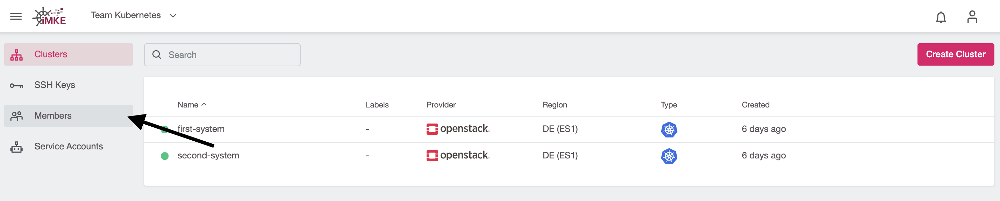
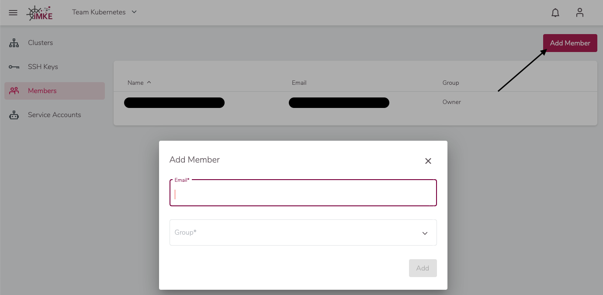
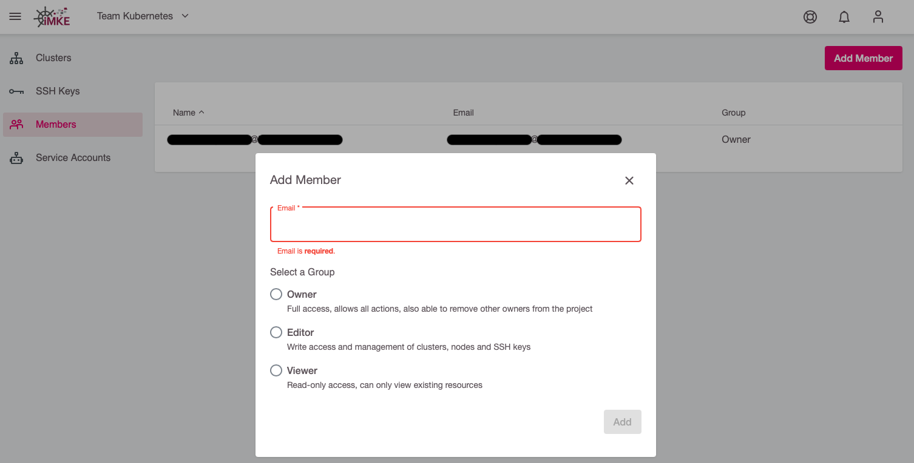
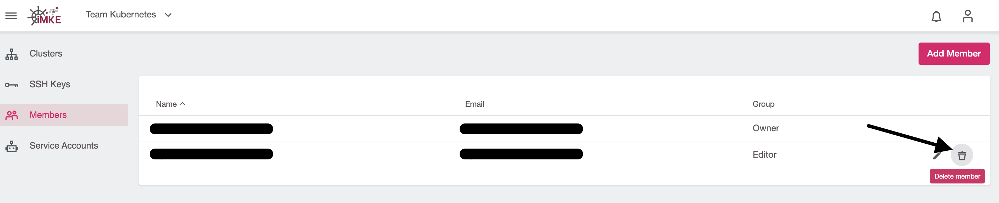

## Add Users

We can add a user to an existing iMKE project with a couple of clicks.

To achieve this, we will need:

* The project name
* The user email

**The user need to log in once, before it is usable.

First, we should select the correct project.

Then click on `Members` in the left sidebar.

Next we click `Add Member` on the top right.

Finally, we need to enter the user email and their desired role (Owner, Editor, or Viewer).

## Remove Users

To remove a User from a Project go back to the member section of the project.

First, we need to go the project.

Then click on `Members` in the left sidebar.

Use the deletion-icon to remove the user.

## User Offboarding

You should remove the user from all projects before requesting to off board the user.
Note that you cannot see projects/clusters where only the user is member of the project. In case those projects do not contain any active cluster, they will be automatically deleted by the IMKE-support during the procession of the off boarding requests. In case there are active clusters left, those will not be automatically deleted and support will ask how to proceed with those.
