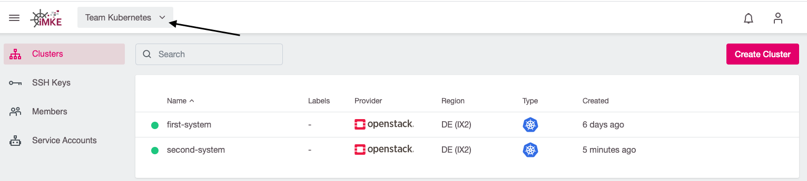
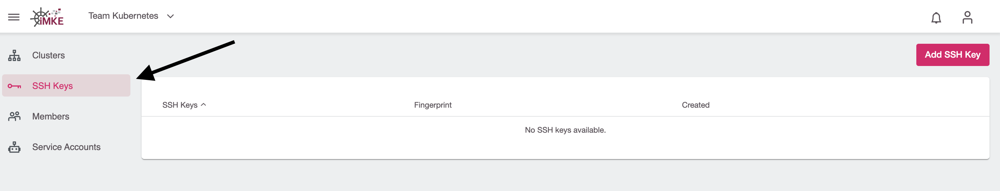
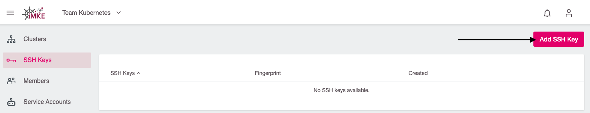
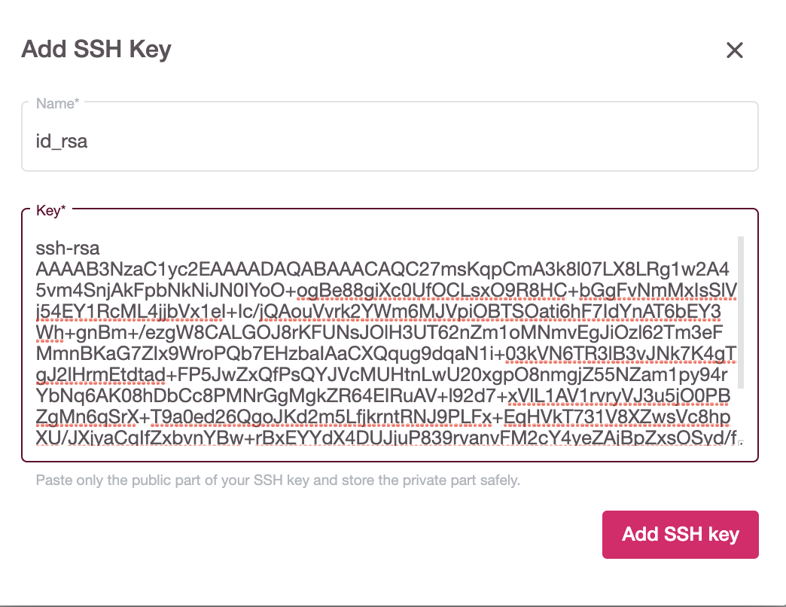
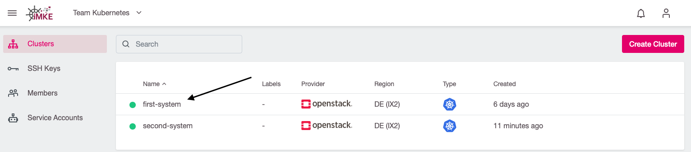
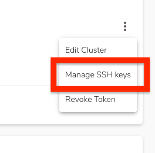
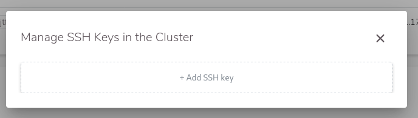
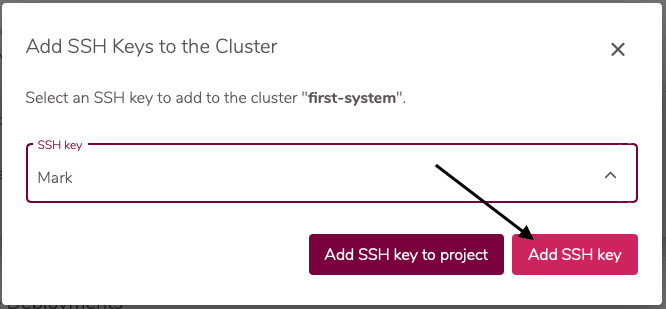

To be able to access to the worker node, you need to add your ssh key.

To achieve this, you will need to:

- Create a ssh key
- Add it to the Project
- Add it to the Cluster

## Creating an ssh key

The simplest way to generate a key pair is to run `ssh-keygen` without arguments:

```bash
ssh-keygen
```

A SSH key will be created. The default path for the ssh key is: `~/.ssh/id_rsa.pub`.

## Add the ssh key to the project

1. Select the project:

    

2. Go to the SSH Key page:

    

3. Use the `Add SSH Key` button:

    

4. Name the key and paste the public SSH key which was created by `ssh-keygen` (not the private key!):

    

Now you can use the key in any cluster in this project.

## Add the ssh key to the cluster

1. Select a cluster where you want to add the key:

    

2. Click the three dots, to open the cluster sub menu:

    

3. Select `Manage SSH keys`:

    

4. Add Key from project keys by clicking on the `+ Add SSH key` field. You can then select the key you just
   created from a drop-down field.
    

5. Finalize by clicking the `Add SSH Key` button:

    

Your Key will now be added to all worker nodes in all machinedeployments.

## Access to the node

To access to the node via SSH you need to attach a Floating IP to them.

To achieve this, you have edit the machinedeployment:


And ensure `Allocate Floating IP` is selected:


Once the node is fully created, and has an external ip, you can access to the node using the key.
The default user for Ubuntu is `ubuntu` and for Flatcar `core`.

```bash
 ssh -A ubuntu@PUBLIC_IP
 ssh -A core@PUBLIC_IP
```
