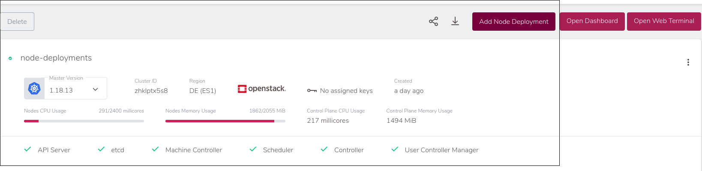
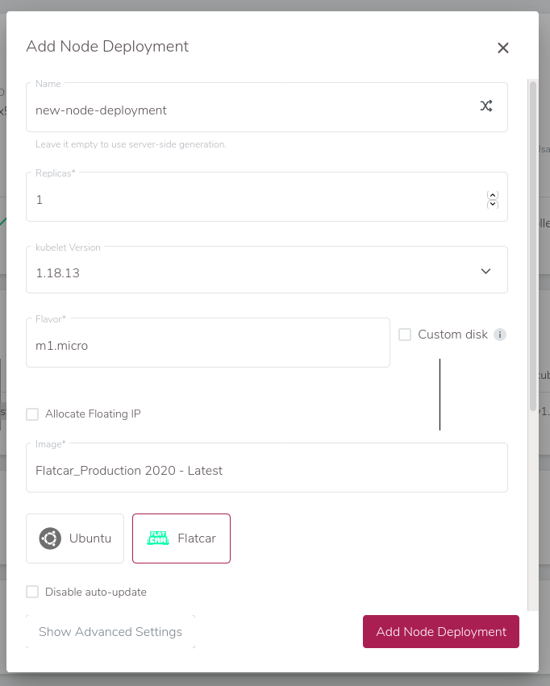
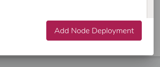
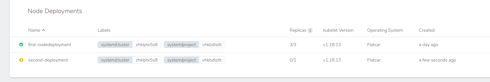
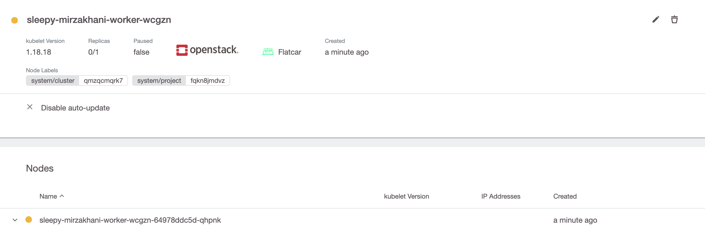
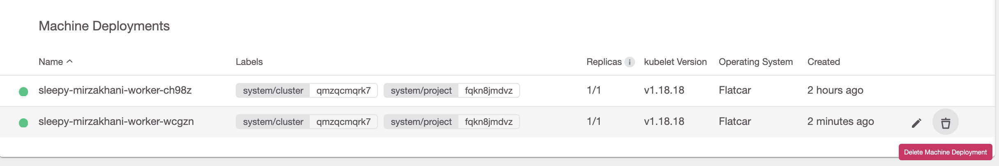
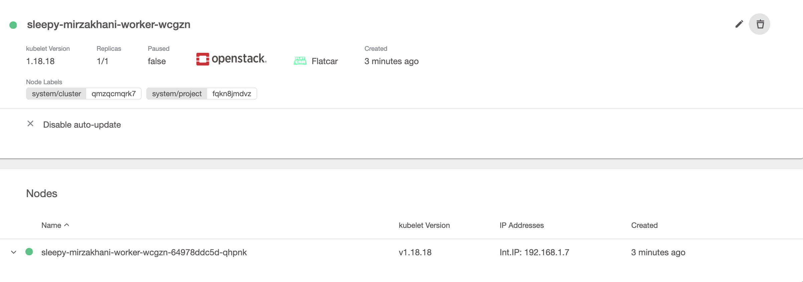

# Add Node Deployment

To add a new node deployment, use the `Add Node Deployment Button` in the right top corner.

This brings up the `Add Node Deployment`-dialog, which has the same options as at cluster creation time:

After pressing `Add Node Deployment`:

the new nodes will be created. You can look at the progress in the node deployment details.

Click on the new node deployment:

and wait until all nodes are green.

# Delete Node Deployment

To delete a node deployment use the trash symbol in either the list:

or the details page:

# Rename Node Deployment

Node deployment can't be renamed. So we need to [create](#add-node-deployment) a second one and [delete](#delete-node-deployment) the old one.

But there is a Gotcha! Deleting a node deployment will delete all nodes at the same time. Depending on our replicas and number of nodes, that can lead to a downtime.

To mitigate this, you should reduce the replica of the node deployment step by step until it is 0 and then delete the node deployment.

The Pods will most likely rescheduled to the new host directly, but it is possible that some pod will end up on old nodes. This will lead to many rescheduled. If that is a problem, it is possible to first cordon all old nodes with `kubectl cordon <node name>` and then slowly reduce the replicas afterwards.
