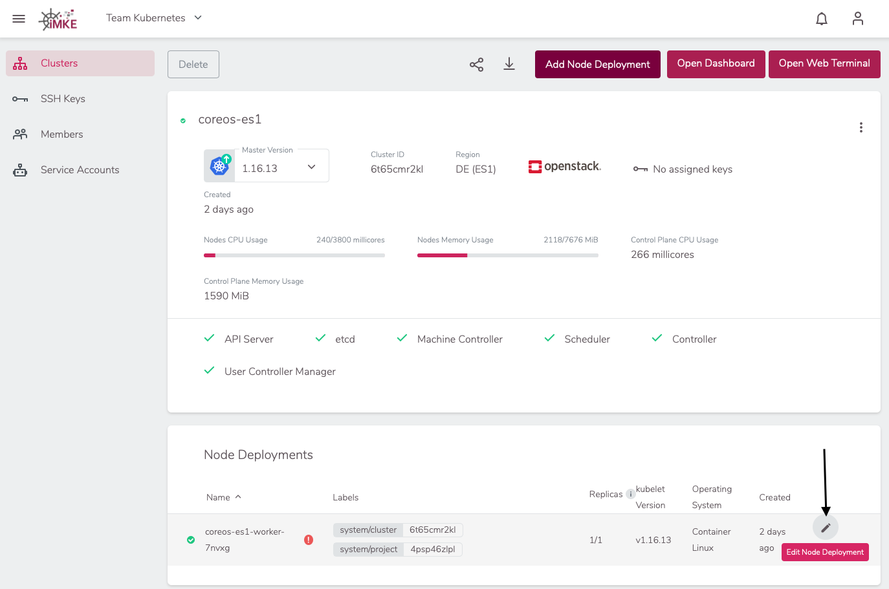
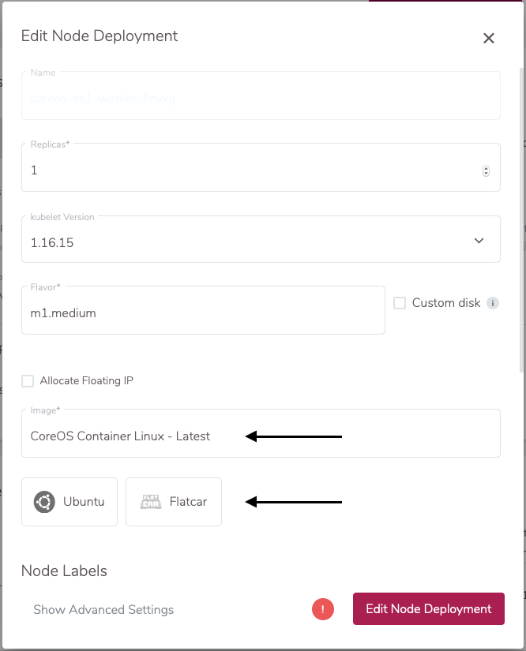
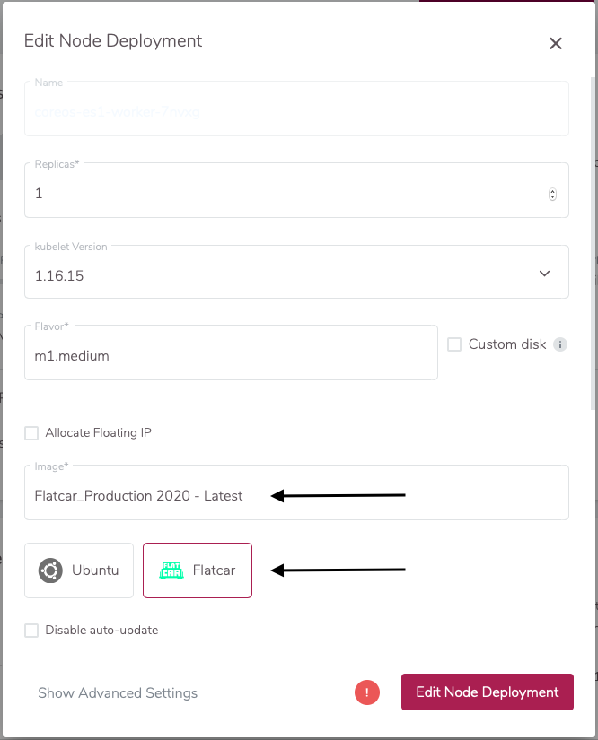

The iMKE platform gives you the control over choosing the OS of worker nodes in your Kubernetes cluster via the `Node Deployment`.
The iMKE platform takes (unless explicity turned off) care of regular OS upgrades such as applying security patches,
but some actions require manual action of the cluster owners:

- Operating Systems going "End of Life"
- Major version upgrades of Operating Systems

As those changes at least require a rolling upgrade of all worker nodes, they will not be executed automatically but require a
manual intervention.

## Operating System End-of-Life

With the iMKE platform release 2.14, we officially ended the support of CoreOS / Container Linux. This is due to the fact that this
distribution is no longer maintained and we're no longer able to receive security patches for it. CoreOS has been replaced by
Flatcar. The following section describes how to perform the Upgrade from CoreOS to Flatcar.

### Identifying clusters with EOL Node-Deployments

Clusters which have Node-Deployments with an end-of-life operating system are marked with a red exclamation mark:

When the cluster is opened, the exclamation mark is also shown on the affected Node-Deployment:

Please note that for operating systems which are still supported but which have a newer major release available, no
exclamation mark is shown. Maintenance mails will announce newer versions and an early upgrade is generally recommended.

### Changing an EOL-OS on Worker-Nodes

To upgrade the Operating System on the Worker-Nodes, you have to start editing the Node-Deployment:

The following screen shows an old image ("CoreOS Container Linux - Latest"), which is no longer supported (end-of-life).
Please just select a supported OS like Flatcar:

Selecting a supported OS will update the Image field as well:

After clicking on `Edit Node Deployment`, all Worker-Nodes will perform a rolling update and reboot with the new OS.
