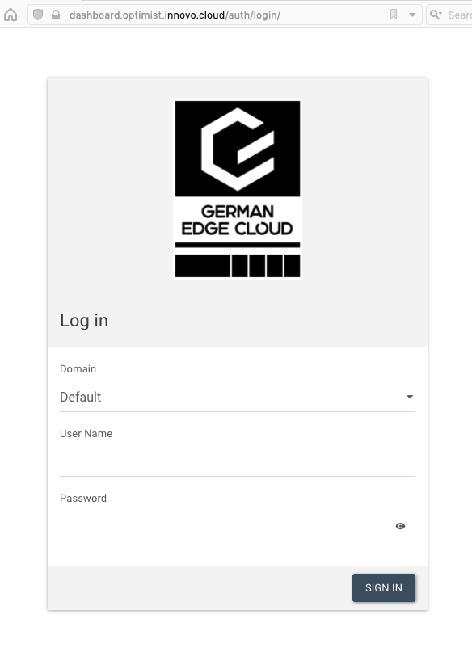

Schritt 1: Das Dashboard (Horizon)
===================================================================

Vorwort
-------

In diesem Schritt für Schritt Tutorial werden wir uns schrittweise der
Bedienung von Openstack widmen. 

Den Anfang macht das Horizon(Dashboard), nach einer kleinen Einführung,
wird dann auf die Konsole gewechselt und der Abschluss bildet die
Erstellung eigener Heat-Templates. 

Login
-----

Nachdem die Zugangsdaten vorliegen, ist der erste Schritt der Login.

**WICHTIG:** Es gibt keinen Reset-Knopf für das Passwort. Für
ein neues Passwort, schreiben Sie uns bitte eine E-Mail
an <info@innovo-cloud.de>.

Hierzu wechseln wir im Browser auf folgende
URL: <https://dashboard.optimist.innovo.cloud/>

Im sich öffnenden Fenster wählen wir bei Domain *default*, und tragen den
zugesendeten Benutzer (User-Name) sowie das zugehörige Passwort(Password) ein
und klicken auf *Connect*.

Nun öffnet sich das Horizon(Dashboard).

Passwort ändern
---------------

Da aus Sicherheitsgründen empfohlen wird das Passwort nach Erhalt zu
ändern, klicken wir im Horizon(Dashboard) dafür rechts oben auf den
Benutzernamen(1) und auf *Settings*(2).

Im sich nun öffnenden Fenster sehen wir zuerst Settings, wo unter
anderem auch die Sprache umgestellt werden kann. 

Um das Passwort zu ändern, klicken wir rechts auf *Change Password*(1).
Hier können nun das Passwort geändert werden. Dafür geben wir zunächst
unser bisheriges Passwort ein(2), geben dann das neue an(3) und
bestätigen es in der neuen Zeile (4).

Damit das neue Passwort auch übernommen wird, fehlt noch ein Klick auf
*Change*(5).

Abschluss
---------

Nachdem wir die ersten Schritte im Horizon geschafft habe, werden wir im
[nächsten Schritt](schritt02.md) einen Stack mit einer Instanz starten.
