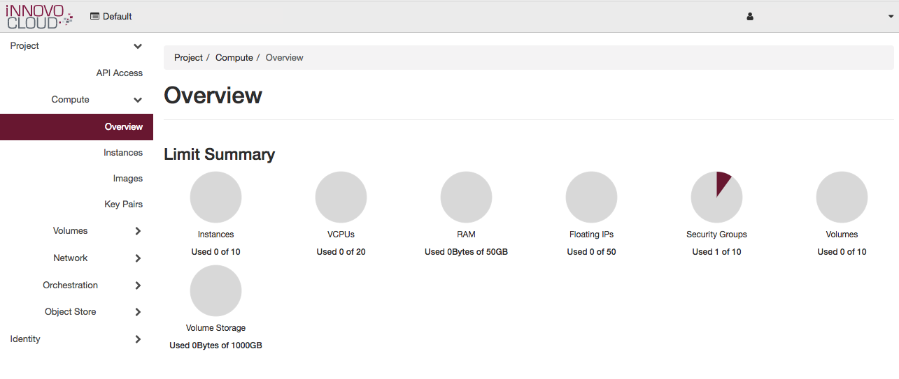
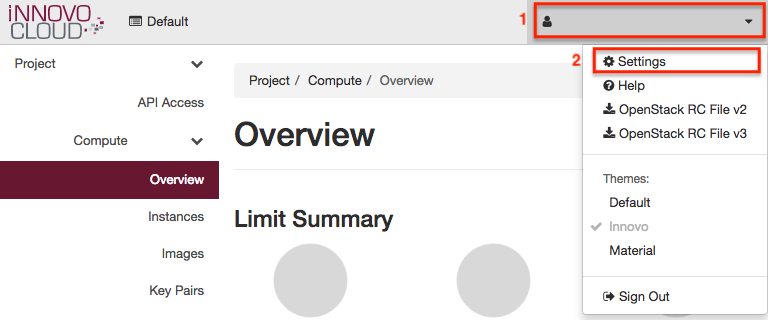
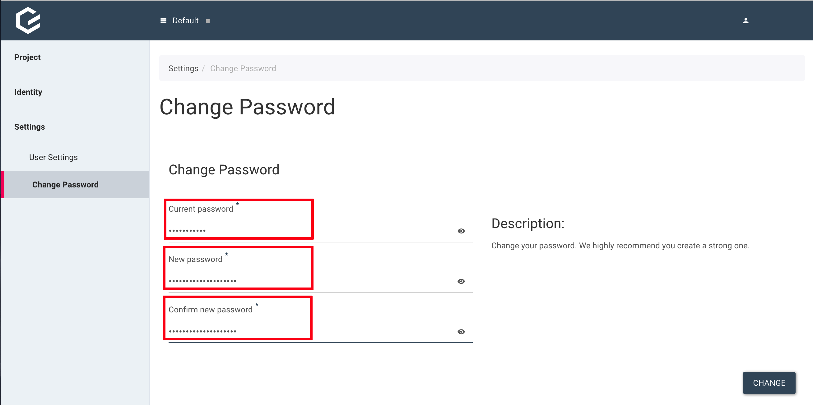

Step 1: The Horizon(Dashboard)
==============================

Preface
-------

In this step by step tutorial, we will ease you into using OpenStack.

We'll start with the Horizon dashboard, after that we'll switch to the
console and then finish up with writing our own Heat
template.

Login
-----

After you have received your credentials, we can log in to the
dashboard.

**IMPORTANT**: There is no automatic way to reset the password, if you
need a new password, please write an e-mail to info@innovo-cloud.de

The URL for the dashboard is <https://dashboard.optimist.innovo.cloud>

You should see the login form, use *default* for the *Domain* field and also use
your username and password in the appropriate fields.

To log in, click *Connect*.

Change Password
---------------

For security reasons we recommend that you change your password after
you received it from us.

It's easily changed via clicking your *Username*(1) in right corner of
the Horizon and then clicking *Settings*(2).

Now you will see the settings page, where you can change various
settings.

To change the password, click on *Change Password*(1) in the left
side-navigation and you need to enter your old one(2), enter the new
one(3) and confirm the new one(4).

To save it, click *Change*(5).

Conclusion
----------

You've taken your first steps in the dashboard and changed your
password!
