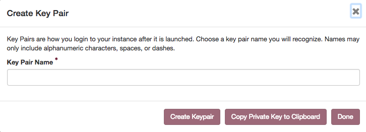

Schritt 2: SSH-Key per Horizon anlegen
======================================

Vorwort
-------

Um im nächsten Schritt einen Stack inkl. einer Instanz zu starten, wird
ein SSH Keypair (Schlüsselpaar) benötigt.

Für den Fall, dass bereits ein Keypair vorhanden ist und der Umgang damit
bekannt ist, kann dieser Schritt übersprungen werden.

Installation
------------

Es gibt verschiedene Wege, um ein Keypair zu erzeugen.

Einer der späteren Schritte erklärt den Weg zu einem selbst erstellten
Keypair. Hier wird der Schlüssel direkt im Horizon(Dashboard) erstellt,
um im nächsten Schritt den Stack zu erstellen.

Um nun den Schlüssel zu erstellen, wechseln wir im Horizon(Dashboard) in
der Navigation auf *Compute* → *Key Pairs* und klicken dort auf *Create
Key Pair*.

Im sich öffnenden Fenster kann nun ein Name für den Key vergeben werden,
in dem Beispiel wird *BeispielKey* verwendet, anschließend klicken wir
auf *Create Key Pair*.

Abschluss
---------

Wir haben jetzt unser SSH Keypair erstellt und sind bereit für den Rest des
Tutorials!
