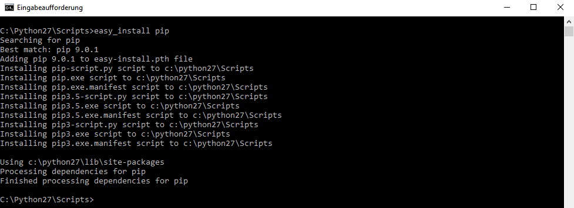

# Step 4: Your way to the console

## Start

To make the administration of OpenStack as simple as possible, we recommend
using
the [OpenStackClient](https://docs.openstack.org/python-openstackclient/latest/).

For simple, non-recurring tasks, it may be easier to use the [Horizon
dashboard](https://dashboard.optimist.gec.io).

With recurring tasks, or when you want to manage a complex stack, it is better to use the *OpenStack client* and *Heat*.

This may be unfamiliar at first, but with some practice, you can quickly and efficiently manage stacks.

The client is helpful in the administration of the OpenStack environment. It contains
Nova, Glance, Cinder, and Neutron.

As we use the client heavily in our Guided Tour, we will install it in the next step.

## Installation

To install the OpenStackClient, you need at least [Python
2.7](https://www.python.org/downloads/release/python-2713/) and [Python
Setuptools](https://pypi.python.org/pypi/setuptools) (which are included in
macOS).

There are several ways to install the OpenStackClient. In our example, we
use [pip](https://de.wikipedia.org/wiki/Pip_(Python)),
and we recommend that you do the same.

"[pip](https://de.wikipedia.org/wiki/Pip_(Python))" is
easy to use and you can also use it as an update manager
for [pip](https://de.wikipedia.org/wiki/Pip_(Python)).

You can install the client as root (the administrative user),
but that may cause problems. Therefore, you can install it in a
virtual environment.

### macOS

To install the OpenStackClient, you need to install
[pip](https://de.wikipedia.org/wiki/Pip_(Python)). Start the console (*Launchpad*
→ *Console*) and type the following command:

```bash
$ easy_install pip
Searching for pip
Best match: pip 9.0.1
Adding pip 9.0.1 to easy-install.pth file
Installing pip script to /usr/local/bin
Installing pip2.7 script to /usr/local/bin
Installing pip2 script to /usr/local/bin

Using /usr/local/lib/python2.7/site-packages
Processing dependencies for pip
Finished processing dependencies for pip
```

Now you can install `virtualenv`.

```bash
$ pip install virtualenv
Collecting virtualenv
  Downloading virtualenv-15.1.0-py2.py3-none-any.whl (1.8MB)
    100% |????????????????????????????????| 1.8MB 619kB/s
Installing collected packages: virtualenv
Successfully installed virtualenv-15.1.0
```

After you have installed `virtualenv`, you can create the virtual environment.

```bash
$ virtualenv ~/.virtualenvs/openstack
New python executable in /Users/iNNOVO/.virtualenvs/openstack/bin/python
Installing setuptools, pip, wheel...done.
```

Now you may activate the virtual environment.

```bash
$ source ~/.virtualenvs/openstack/bin/activate
(openstack) $
```

Now you can install the OpenStack client.

```bash
(openstack) $ pip install python-openstackclient
```

Since we use other services in our documentation, you can install these clients as well.

```bash
(openstack) $ pip install python-heatclient python-designateclient python-octaviaclient
```

Now that you are done, you can deactivate your environment.

```bash
(openstack) $ deactivate
```

Finally, ensure that you can use the client outside of your virtual environment.

```bash
export PATH="$HOME/.virtualenvs/openstack/bin/:$PATH"
```

Now you can check that everything works. It should look like this:

```bash
$ type -a openstack
openstack is /home/iNNOVO/.virtualenvs/openstack/bin/openstack
```

### Windows

If Python is already installed, you need to navigate to installation folder
(standard installation folder C:\Python27\Scripts).

To install *pip*, use the command `easy_install pip`:



Once *pip* is installed, you can install the OpenStack client:


### Linux (in our example Ubuntu)

First, install *pip*.

```bash
$ sudo apt-get install python3-pip
Reading package lists... Done
Building dependency tree
Reading state information... Done
```

Next, install *virtualenv*, which is required to set up your virtual
environment.

```bash
$ sudo apt-get install python3-virtualenv
Reading package lists... Done
Building dependency tree
Reading state information... Done
```

Now you can create a virtual environment where you install the OpenStack client.

```bash
$ virtualenv ~/.virtualenvs/openstack
New python executable in /Users/iNNOVO/.virtualenvs/openstack/bin/python
Installing setuptools, pip, wheel...done.
```

Then you can activate your newly created environment.

```bash
$ source ~/.virtualenvs/openstack/bin/activate
(openstack) $
```

Once activated, you can install the
[OpenStackClient](https://docs.openstack.org/python-openstackclient/latest/):

```bash
(openstack) $ pip install python-openstackclient
```

As we use *Heat* in our documentation, you will also install the *Heat*
client.

```bash
(openstack) $ pip install python-heatclient
```

Once you are done, you can deactivate your virtual environment.

```bash
(openstack) $ deactivate
```

Finally, ensure that you can use your newly installed software.

```bash
export PATH="$HOME/.virtualenvs/openstack/bin/:$PATH"
```

Now you can check that everything works. It should look like this:

```bash
$ type -a openstack
openstack is /home/iNNOVO/.virtualenvs/openstack/bin/openstack
```

## Credentials

For the OpenStack client to work, you need to supply it with the credentials.

You can download the credentials directly from
the [Horizon](https://dashboard.optimist.gec.io/identity/)
dashboard. After the login, click on your mail address in the right corner. Then click
 *Download OpenStack RC File v3*.

### macOS | Linux

You need to source the credentials, which can be easily done
with this command (IMPORTANT: The command can only be used in the folder where
the RC file was downloaded):  

```bash
source EXAMPLE.sh
```

### Windows

To source the credentials on Windows, you must use
*PowerShell*, *Git for Windows* or [*Linux on Windows*](https://docs.microsoft.com/en-us/windows/wsl/install-win10).

If you use *Git for Windows* or *Linux on Windows*, you can use the same commands described
in the macOS | Linux section.

```bash
source EXAMPLE.sh
```

If you use *PowerShell*, you need to set each variable individually.
All required variables are in the previously downloaded *Beispiel.sh*.
To set the variables, use the following command:

```bash
set-item env:OS_AUTH_URL -value "https://identity.optimist.gec.io/v3"
set-item env:OS_PROJECT_ID -value "Projekt ID eintragen"
set-item env:OS_PROJECT_NAME -value "Namen eintrage"
set-item env:OS_USER_DOMAIN_NAME -value "Default"
set-item env:OS_USERNAME -value "Usernamen eintragen"
set-item env:OS_PASSWORD -value "Passwort eingeben"
set-item env:OS_USER_DOMAIN_NAME -value "Default"
set-item env:OS_REGION_NAME -value "fra"
set-item env:OS_INTERFACE -value "public"
set-item env:OS_IDENTITY_API_VERSION -value "3"
```

## Conclusion

You now have an OpenStack client with working credentials, and can test the commands.

To get an overview of all OpenStack commands, run the following command:

```bash
openstack --help
```
