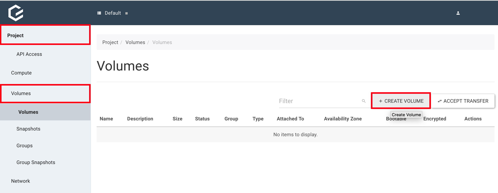
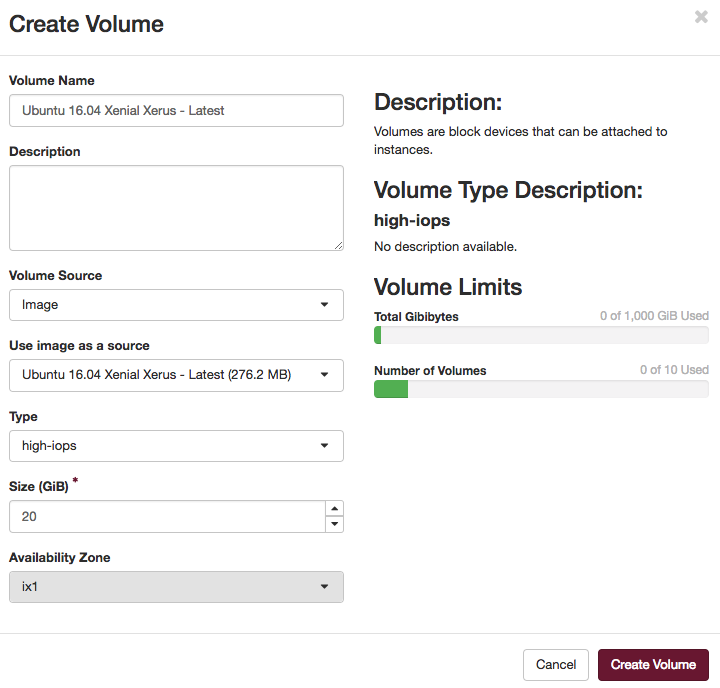
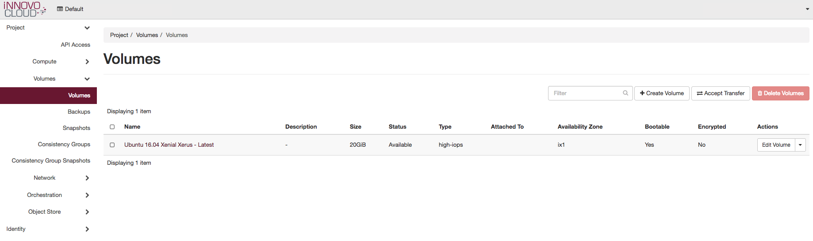
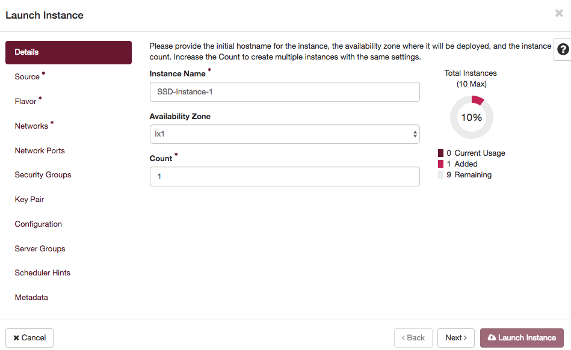
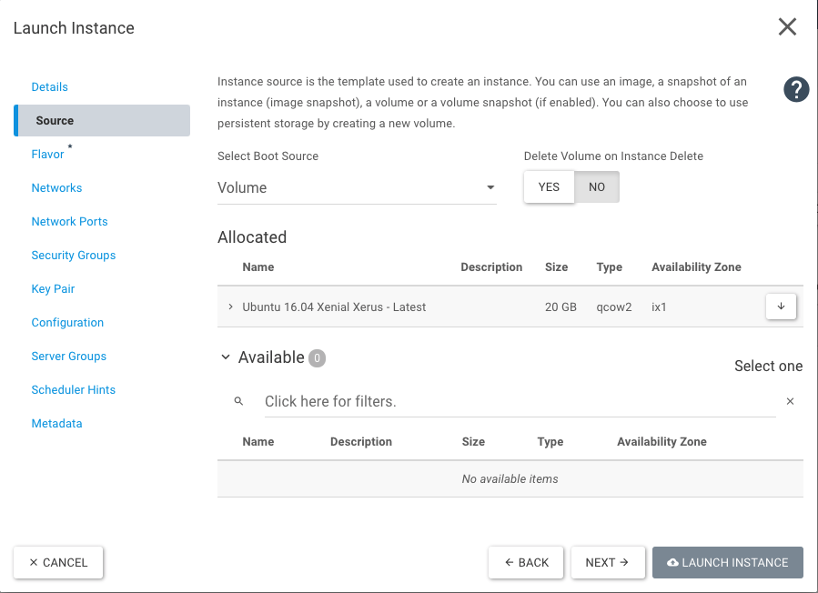
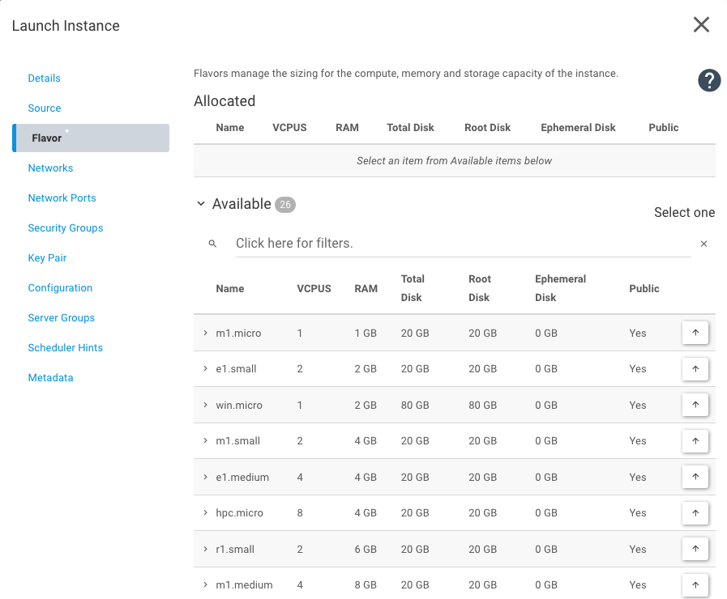
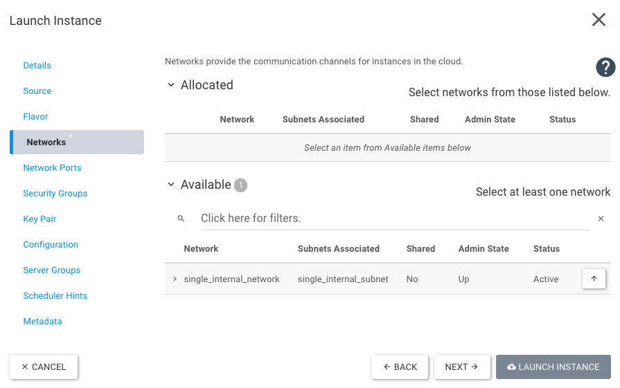

# Step 21: Start a VM with an SSD volume

## Start

Previously, you created a VM from scratch and also learned some HEAT basics. In this step you will boot a VM from an SSD volume. There are different ways to do this.
In this step, we will first outline how to do so using Horizon (Dashboard) and secondly outline a different method which modifies the HEAT-Template from [Step 18: Your VM will be reachable via IPv4](/optimist/guided_tour/step18/).

## The Horizon (Dashboard) way

To get started, you need to log in to Horizon, as described in "Step 1: The Horizon (Dashboard)" [Step 1: The Horizon (Dashboard)](/optimist/guided_tour/step1/).
Next, create a new volume with *Project → Volumes → Volumes* and a click on *+ CREATE VOLUME*.



You need to fill in some information in the new overlay; a description for all required fields are below. After filling out the form, click on *CREATE VOLUME*

- Volume Name: Defines the name of the volume. In our example it will be prefilled with *Ubuntu 16.04 Xenial Xerus - Latest*.
- Description: If required, you can add a short description. In our example, it is empty.
- Volume Source: You can choose between *Image* and *No source, empty image*. Please use *Image*.
- Use image as a source: You can choose any image, here we used *Ubuntu 16.04 Xenial Xerus - Latest (276.2 MB)*.
- Type: Three options are available *high-iops*, *low-iops* or *default*. To use the SSD storage, you need to choose *high-iops*.
- Size: You can define the size of the volume, we chose 20 GiB.
- Availability Zone: Again there are three options available *Any Availability Zone*, *es1*, or *ix1*. Use *ix1*.



After volume creation, it should look like this:



There are two options to start a VM.
The first option is to click on the down arrow symbol next to *Edit Volume* (as pictured above) and click on *Launch as Instance*.

There will be a new overlay where you can choose the name (Instance Name) and the availability zone. Please use the same availability zone as previously used for the image (*ix1*).



Switch to *Source* and choose *Volume* for *Select Boot Source* and click on the up-arrow next to the available volume.



Switch to *Flavor* and choose one of the available flavors by clicking on the up-arrow.



Next you need to choose a network in *Networks*. Use one of your networks and click on the up-arrow next to it.



Now all required settings are in place and the VM can be started with *Launch Instance*.
If required you can add your own Security Groups and/or Key Pairs.

## The HEAT way

This step uses the HEAT Template from Step 18. It will start a VM by default, so the next step is to adapt it, to allow it to create and boot from an SSD volume.
First, add a new parameter "availability_zone":

```yaml
heat_template_version: 2014-10-16

parameters:
    key_name:
        type: string
    public_network_id:
        type: string
        default: provider
 availability_zone:
  type: string
  default: ix1
```

Now add *boot_ssd* at the end of our template:

```yaml
 boot_ssd:
        type: OS::Cinder::Volume
        properties:
            name: boot_ssd
            size: 20
            availability_zone: { get_param: availability_zone }
            volume_type: high-iops
            image: "Ubuntu 16.04 Xenial Xerus - Latest"
```

You have added a new parameter and will use this in your new volume.
To start the VM from the volume, you need to edit *Instanz* in your template.
You can delete or comment out *image*, because it is already associated with your volume.
Now you can add *availability_zone*, *name*, *networks*, and *block_device_mapping*:

```yaml
    Instanz:
        type: OS::Nova::Server
        properties:
   name: SSD-Test
   availability_zone: { get_param: availability_zone }
            key_name: { get_param: key_name }
            #image: Ubuntu 16.04 Xenial Xerus - Latest
            flavor: m1.small
   networks:
                - port: { get_resource: Port }
            block_device_mapping: [
                { device_name: "vda",
                  volume_id: { get_resource: boot_ssd },
                  delete_on_termination: "true" } ]
```

The template is finished and should look like this:

```yaml
heat_template_version: 2014-10-16

parameters:
    key_name:
        type: string
    public_network_id:
        type: string
        default: provider
 availability_zone:
  type: string
  default: ix1

resources:

    Instanz:
        type: OS::Nova::Server
        properties:
   name: SSD-Test
   availability_zone: { get_param: availability_zone }
            key_name: { get_param: key_name }
            #image: Ubuntu 16.04 Xenial Xerus - Latest
            flavor: m1.small
   networks:
                - port: { get_resource: Port }
            block_device_mapping: [
                { device_name: "vda",
                  volume_id: { get_resource: boot_ssd },
                  delete_on_termination: "true" } ]

    Netzwerk:
        type: OS::Neutron::Net
            properties:
            name: BeispielNetzwerk

    Port:
        type: OS::Neutron::Port
        properties:
            network: { get_resource: Netzwerk }

    Router:
        type: OS::Neutron::Router
        properties:
            external_gateway_info: { "network": { get_param: public_network_id }
            name: BeispielRouter

    Subnet:
        type: OS::Neutron::Subnet
        properties:
            name: BeispielSubnet
            dns_nameservers:
                - 8.8.8.8
                - 8.8.4.4
            network: { get_resource: Netzwerk }
            ip_version: 4
            cidr: 10.0.0.0/24
            allocation_pools:
                - { start: 10.0.0.10, end: 10.0.0.250 }

    Router_Subnet_Bridge:
        type: OS::Neutron::RouterInterface
        depends_on: Subnet
        properties:
            router: { get_resource: Router }
            subnet: { get_resource: Subnet }

    Floating_IP:
        type: OS::Neutron::FloatingIP
        properties:
            floating_network: { get_param: public_network_id }
            port_id: { get_resource: Port }

    Sec_SSH:
        type: OS::Neutron:SecurityGroup
        properties:
            description: Diese Security Group erlaubt den eingehenden SSH-Traffic über Port22 und ICMP
            name: Ermöglicht SSH (Port22) und ICMP
            rules:
                - { direction: ingress, remote_ip_prefix: 0.0.0.0/0, port_range_min: 22, port_range_max: 22, protocol: tcp }
                - { direction: ingress, remote_ip_prefix: 0.0.0.0/0, protocol: icmp }


 boot_ssd:
        type: OS::Cinder::Volume
        properties:
            name: boot_ssd
            size: 20
            availability_zone: { get_param: availability_zone }
            volume_type: high-iops
            image: "Ubuntu 16.04 Xenial Xerus - Latest"
```

## Conclusion

You have learned to start an instance from a volume and how to use SSD storage.
Additionally, you have refreshed your heat knowledge and included a volume.
