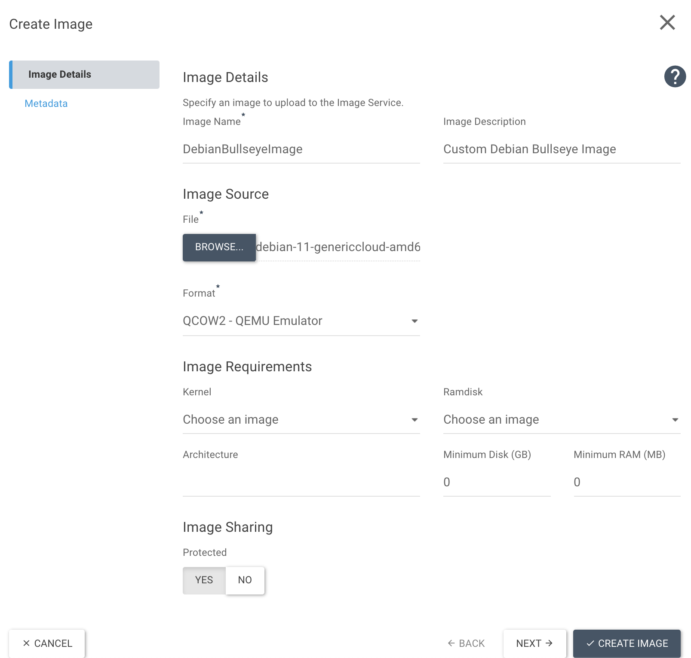

# Uploading Custom Images to OpenStack

As well as having a range of our own Optimist images to choose from, users may also upload their own images, either via the Optimist Dashboard or via the CLI.

## Upload Image via Dashboard

An image can be uploaded to the dashboard by navigating to the Images section of the Dashboard under Project > Images > Create Image 

Click "Create Image" to begin creating a new custom image, here you will see the following options:


An overview of each section:
- `Name`: Enter a name for the image.
- `Description`: Enter a brief description of the image.
- `Image Source (File)`: Here we can upload the image file we want to use.
- `Format`: The depends on our image format extension, in this case we are using qcow2.
- `Image Sharing`: Protected (Yes/No) - Selecting "No" allows the image to be shared with the userbase.

The other fields are optional: Kernel, Ramdisk, Minimum Disk (GB), and Minimum RAM (GB) can be left blank if preferred.

Click "Create Image" to begin creating the image. The image will shortly be available on the dashboard.

## Upload Image via CLI 

We can also upload the same file via the CLI. Depending on the location of the file, it may help to run the touch commnd to ensure it is reachable:

`$ touch debian-11-genericcloud-amd64.qcow2`

Using the following command, we can now create an image directly from the CLI:
```bash
$ openstack image create --disk-format qcow2 --container-format bare --private --file ./debian-11-genericcloud-amd64.qcow2 CustomDebianBullseyeImage
+------------------+-------------------------------------------------------------------------------------------------------------------------------------------------------------------------------+
| Field            | Value                                                                                                                                                                         |
+------------------+-------------------------------------------------------------------------------------------------------------------------------------------------------------------------------+
| container_format | bare                                                                                                                                                                          |
| created_at       | 2022-03-31T06:47:19Z                                                                                                                                                          |
| disk_format      | qcow2                                                                                                                                                                         |
| file             | /v2/images/532e26209e22-4048-5747-9b36-28e0d279/file                                                                                                                          |
| id               | 532e26209e22-4048-5747-9b36-28e0d279                                                                                                                                          |
| min_disk         | 0                                                                                                                                                                             |
| min_ram          | 0                                                                                                                                                                             |
| name             | CustomDebianBullseyeImage                                                                                                                                                     |
| owner            | ac5a32b34bc906ac5a32b34b54a                                                                                                                                                   |
| properties       | locations='[]', os_hidden='False', owner_specified.openstack.md5='', owner_specified.openstack.object='images/CustomDebianBullseyeImage', owner_specified.openstack.sha256='' |
| protected        | False                                                                                                                                                                         |
| schema           | /v2/schemas/image                                                                                                                                                             |
| status           | queued                                                                                                                                                                        |
| tags             |                                                                                                                                                                               |
| updated_at       | 2022-03-31T06:47:19Z                                                                                                                                                          |
| visibility       | private                                                                                                                                                                       |
+------------------+-------------------------------------------------------------------------------------------------------------------------------------------------------------------------------+
```

The command requires these fields at a minimum:
- `--disk-format`: qcow2 - in this case. This depends on the image file extension.
- `--container-format`: bare 
- `--private`: Specify whether we want our image to be --private or --public
- `--file` The specific image file we want to use for example: ./debian-11-genericcloud-amd64.qcow2 
- Name of the Image: In this case, "CustomDebianBullseyeImage"

The same fields apply as when uploading via the dashboard, along with the optional fields with Minimum Disk / RAM etc.
