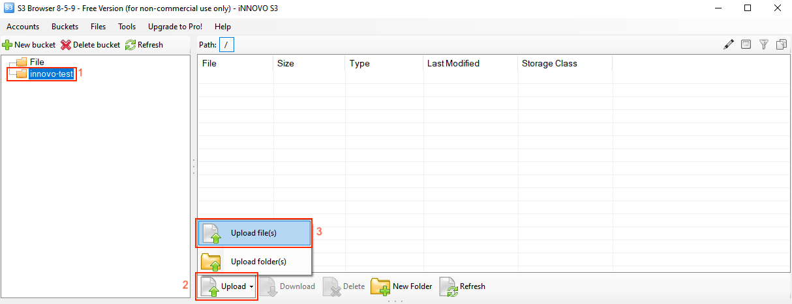

Ein Objekt hochladen und löschen
=================================================

Inhalt:
---------
- [S3cmd](#s3cmd)
	- [Objekt hochladen](#objekt-hochladen)
	- [Objekt löschen](#objekt-löschen) 
- [S3Browser](#s3browser)
	- [Objekt hochladen](#objekt-hochladen-1)
	- [Objekt löschen](#objekt-löschen-1)
- [Cyberduck](#cyberduck)
	- [Objekt hochladen](#objekt-hochladen-2)
	- [Objekt löschen](#objekt-löschen-2)
- [Boto3](#boto3)
	- [Objekt hochladen](#objekt-hochladen-3)
	- [Objekt löschen](#objekt-löschen-3)

Zum Hochladen Ihrer Daten wie zum Beispiel (Dokumente, Fotos, Videos, usw.) ist es zunächst notwendig einen [Bucket zu erstellen](#CreateAndDeleteBucketDE.md).
Eine Datei kann dabei nur in einem Bucket gespeichert werden. 

[S3cmd](#s3cmd)
=============

# Objekt hochladen

Um eine Datei hochzuladen, nutzt man folgenden Befehl:

```bash
$ s3cmd put NameDerDatei s3://NameDesBuckets/NameDerDatei
```

Die Ausgabe in der Kommandozeile kann dann so aussehen:

```bash
$ s3cmd put innovo.txt s3://innovo-test/innovo.txt<font></font>
upload: 'innovo.txt' -> 's3://innovo-test/innovo.txt'  [1 of 1]<font></font>
 95 of 95   100% in    0s   176.63 B/s  done
```

# Objekt löschen

Um eine Datei zu löschen, nutzt man folgenden Befehl:

```bash
$ s3cmd del s3://NameDesBuckets/NameDerDatei
```

Die Ausgabe in der Kommandozeile kann dann so aussehen:

```bash
$ s3cmd del s3://innovo-test/innovo.txt<font></font>
delete: 's3://innovo-test/innovo.txt'
```

[S3Browser](#s3browser)
=============

# Objekt hochladen

Nach dem öffnen von S3Browser, klicken wir auf den gewünschten "Bucket"(1), wähle dann "Upload"(2) und zu letzt "Upload file(s)"(3)



Hier wählen wir nun die entsprechende Datei(1) aus und klicken auf Öffnen(2).


# Objekt löschen

Um eine Datei zu löschen, wird dieser mit einem linken Mausklick markiert(1). Danach wird auf "Delete"(2) geklickt.


Die darauf folgende Abfrage wird mit "Ja" bestätigt. 

[Cyberduck](#cyberduck)
=============

# Objekt hochladen

Nach dem Öffnen von Cyberduck, klicken wir auf den gewünschten Bucket(1), klicken dann auf Aktion(2) und dort auf Upload(3).


Hier wählen wir nun unsere Wunsch-Datei und klicken auf Upload.


# Objekt löschen

Um eine Datei zu löschen, wird dieser mit einem linken Mausklick markiert(1). Gelöscht wird sie dann über "Aktion"(2) und "Löschen"(3). 


Die Bestätigung erfolgt dann über das erneute klicken auf "Löschen".


[Boto3](#boto3)
=============

Bei boto3 brauchen wir zunächst die S3 Kennung, damit ein Script nutzbar ist. Für Details: S3 Kennung erstellen und einlesen#boto3

# Objekt hochladen

Um nun eine Datei hochzuladen, müssen wir einen Clienten nutzen und den Bucket angeben in welchen die Datei hochgeladen werden soll. 
Eine Option sieht so aus:

```bash
## Erstellung eines S3 Clienten
s3 = boto3.client('s3')

## Hochladen einer Datei
s3.upload_file(Bucket='iNNOVO-Test', Key='innovo.txt')
```

Ein komplettes Script für boto 3 inkl. Authentifizierung kann so aussehen:

```python
#!/usr/bin/env/python

## Definieren das boto3 genutzt werden soll
import boto3
from botocore.client import Config

## Authentifizierung
s3 = boto3.resource('s3',
                        endpoint_url='https://s3.es1.fra.optimist.innovo.cloud',<font></font>
                        aws_access_key_id='aaaaaaaaaaaaaaaaaaaaaaaaaaaaaaaa',<font></font>
                        aws_secret_access_key='bbbbbbbbbbbbbbbbbbbbbbbbbbbbbbbbbb',<font></font>
                    )

## Erstellung eines S3 Clienten
s3 = boto3.client('s3')

## Hochladen einer Datei
s3.upload_file(Bucket='iNNOVO-Test', Key='innovo.txt')
```

# Objekt löschen

Wie beim hochladen einer Datei, wird zunächst ein Client benötigt um dann die Datei zu löschen.
Dafür geben wir neben der Datei selber, auch noch den Bucket an, in dem die Datei gespeichert ist. 
Eine Option sieht so aus:

```bash
## Erstellung eines S3 Clienten
s3 = boto3.client('s3')

## Löschen eines Objekts
s3.delete_object(Bucket='iNNOVO-Test', Key='innovo.txt')
```

Ein komplettes Script für boto 3 inkl. Authentifizierung kann so aussehen:

```python
#!/usr/bin/env/python

## Definieren das boto3 genutzt werden soll
import boto3
from botocore.client import Config

## Authentifizierung
s3 = boto3.resource('s3',
                        endpoint_url='https://s3.es1.fra.optimist.innovo.cloud',
                        aws_access_key_id='aaaaaaaaaaaaaaaaaaaaaaaaaaaaaaaa',
                        aws_secret_access_key='bbbbbbbbbbbbbbbbbbbbbbbbbbbbbbbbbb',
                    )

## Erstellung eines S3 Clienten
s3 = boto3.client('s3')

## Löschen eines Objekts
s3.delete_object(Bucket='iNNOVO-Test', Key='innovo.txt')
```
