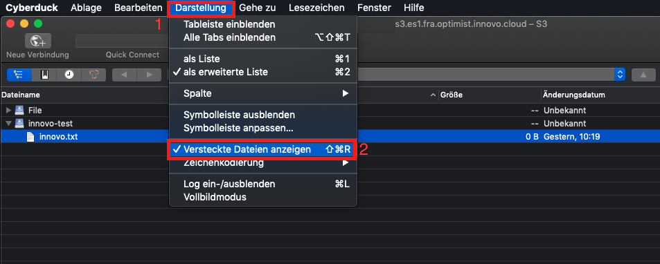
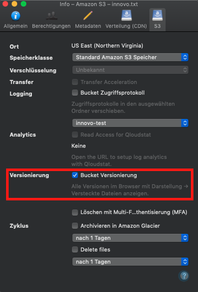

Enable and Disable Versioning, and Delete a versioned object
=================================================

Contents:
-----------
- [S3cmd](#s3cmd) 
- [S3Browser](#s3browser)
- [Cyberduck](#cyberduck)
- [Boto3](#boto3)

Versioning makes it possible to store multiple versions of an object in a bucket.
For example, files named innovo.txt (version 1) and innovo.txt (version 2) can be stored in a single bucket.
Versioning can protect you from the consequences of accidental overwrites or deletion.

[S3cmd](#s3cmd)
=============

With S3cmd it is not possible to enable versioning or to delete versioned files.

[S3Browser](#s3browser)
=============

## Enable versioning

To enable versioning, select a Bucket(1).
Right click on the bucket and then click on "Edit Versioning Settings"(2).


In the newly opened window, click the checkbox for "Enable versioning for bucket"(1) and confirm this with "OK"(2).


## Disable versioning

To disable versioning, select a Bucket(1).
Right-click on the bucket and select "Edit Versioning Settings"(2).


In the newly opened window, remove the checkbox at "Enable versioning for bucket"(1) and confirm this with "OK"(2).


## Delete a versioned object

This is not possible in the free version of S3Browser.

[Cyberduck](#cyberduck)
=============
To see the different versions of a file, hidden files must be displayed.
This option can be found at View(1) → Show hidden files(2)



## Enable versioning

After opening Cyberduck, we select the file on which we wish to activate versioning(1) for.
Then click Action(2) and Info(3).


Then the following window opens, here we check the box "Bucket Versioning"(1):



## Disable versioning

To disable versioning, we select the file(1) again, go to Action(2) and Info(3).


In the window that opens, the check mark for "Bucket Versioning" should be removed.


## Delete a versioned object

Simply select the file to be deleted(1) and click Action(2) → Delete(3) to remove it.


[Boto3](#Boto3)
=============
In Boto3 we first need S3 credentials so that a script can be used. For details see: [Create and use S3 credentials #Boto3](https://docs.gec.io/optimist/storage/s3_documentation/createanduses3credentials).

## Enable versioning

To enable the versioning, we will enter the bucket first and then activate the versioning.
One option looks like this:

```bash
## Specifies the bucket in which versioning is to be activated.
bucket = s3.Bucket('iNNOVO-Test')
 
## Activate versioning
bucket.configure_versioning(True)
```

A complete script for boto 3, including authentication, could look like this:

```python
#!/usr/bin/env/python
 
## Define that boto3 should be used
import boto3
from botocore.client import Config
 
## Authentication
s3 = boto3.resource('s3',
                        endpoint_url='https://s3.es1.fra.optimist.innovo.cloud',
                        aws_access_key_id='aaaaaaaaaaaaaaaaaaaaaaaaaaaaaaaa',
                        aws_secret_access_key='bbbbbbbbbbbbbbbbbbbbbbbbbbbbbbbbbb',
                    )
 
## Specifies the bucket in which versioning is to be activated.
bucket = s3.Bucket('iNNOVO-Test')
 
## Activate versioning
bucket.configure_versioning(True)
```

## Disable versioning

As with the activation of versioning, the bucket is needed to deactivate versioning. 
One option looks like this:

```bash
## Specifies the bucket in which versioning is to be activated.
bucket = s3.Bucket('iNNOVO-Test')
 
## Deactivate versioning
bucket.configure_versioning(False)
```
A complete script for boto 3 including authentication could look like this:

```python
#!/usr/bin/env/python
 
## Define that boto3 should be used
import boto3
from botocore.client import Config
 
## Authentication
s3 = boto3.resource('s3',
                        endpoint_url='https://s3.es1.fra.optimist.innovo.cloud',
                        aws_access_key_id='aaaaaaaaaaaaaaaaaaaaaaaaaaaaaaaa',
                        aws_secret_access_key='bbbbbbbbbbbbbbbbbbbbbbbbbbbbbbbbbb',
                    )
 
 
## Specifies the bucket in which versioning is to be activated.
bucket = s3.Bucket('iNNOVO-Test')
 
## Deactivate versioning
bucket.configure_versioning(False)
```

## Delete a versioned object

To delete a versioned object completely, the following command is helpful:

```bash
## Specifies the bucket in which versioning is to be activated.
bucket = s3.Bucket('iNNOVO-Test')
 
## Delete versioned object
bucket.object_versions.all().delete('innovo.txt')
```
