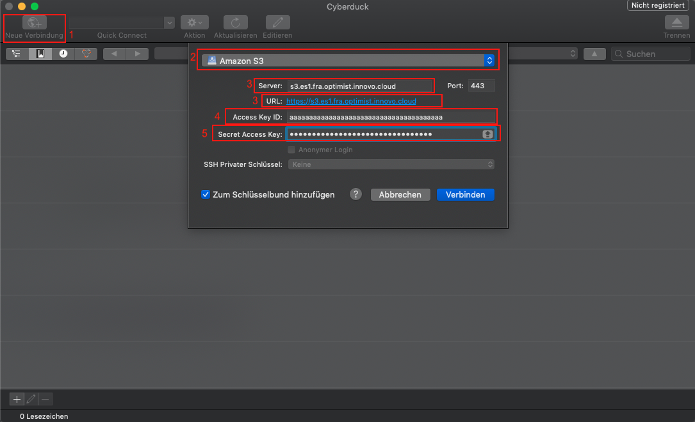

S3 Kennung erstellen und einlesen
=================================================

Inhalt:
---------
- [Benutzerdaten erstellen](#benutzerdatenerstellen)
	- [S3cmd](#s3cmd)
	- [S3Browser](#s3browser)
	- [Cyberduck](#cyberduck)
	- [Boto3](#boto3)
- [Benutzerdaten anzeigen](#benutzerdatenanzeigen)
- [Benutzerdaten löschen](#benutzerdatenlöschen)

# Benutzerdaten erstellen

Damit wir auf den Object Storage zugreifen können, benötigen wir zunächst Login Daten(Credentials).
Um diese Daten per OpenStackAPI erzeugen zu können, benötigen wir den OpenStackClient und führen dort folgenden Befehl aus:

`$ openstack ec2 credentials create`

Wenn die Daten korrekt erstellt worden sind, sieht die Ausgabe in etwa so aus:

```bash
$ openstack ec2 credentials create
+------------+-----------------------------------------------------------------+
| Field      | Value                                                           |
+------------+-----------------------------------------------------------------+
| access     | aaaaaaaaaaaaaaaaaaaaaaaaaaaaaaa                                 |
| links      | {u'self': u'https://identity.optimist.innovo.cloud/v3/users/bbb |
|            | bbbbbbbbbbbbbbbbbbbbbbbbbbbbb/credentials/OS-                   |
|            | EC2/aaaaaaaaaaaaaaaaaaaaaaaaaaaaaaa'}                           |
| project_id | cccccccccccccccccccccccccccccccc                                |
| secret     | dddddddddddddddddddddddddddddddd                                |
| trust_id   | None                                                            |
| user_id    | bbbbbbbbbbbbbbbbbbbbbbbbbbbbbbbb                                |
+------------+-----------------------------------------------------------------+
```
Nachdem die Zugangsdaten (Credentials) vorliegen, brauchen wir eine Möglichkeit auf den S3 kompatiblen ObjectStorage zuzugreifen.
Hierfür gibt es die unterschiedliche Möglichkeiten, in der Dokumentation stellen wir hierfür vier Möglichkeiten vor, genauer: [S3cmd](https://s3tools.org/s3cmd) für Linux/Mac, [S3Browser](https://s3browser.com/) für  Windows, [Cyberduck](https://cyberduck.io/) und [Boto3](https://boto3.amazonaws.com/v1/documentation/api/latest/index.html).

# Benutzerdaten in die Konfigurationsdatei eintragen

## S3cmd

Um s3cmd zu installieren, brauchen wir einen Paketmanager wie zum Beispiel "pip". Die Installation und Nutzung erklären wir im [Schritt 4: "Der Weg vom Horizon auf die Kommandozeile"](/optimist/guided_tour/step04/) unserer Guided Tour.
Der Befehl für die Installation lautet dann:

```
$ pip install s3cmd
```

Nach der erfolgreichen Installation von s3cmd, müssen die vorher erstellten Zugangsdaten (Credentials) in die Konfigurationsdatei von s3cmd eingetragen werden.
Die dafür zuständige Datei ist die ".s3cfg", welche sich standardgemäß im Homeverzeichnis befindet. Sollte diese noch nicht existieren, muss diese vorher erstellt werden.

Folgende Daten tragen wir dann in der .s3cfg ein und speichern diese:

```bash
access_key = aaaaaaaaaaaaaaaaaaaaaaaaaaaaaaaaaaaaaaa
check_ssl_certificate = True
check_ssl_hostname = True
host_base = s3.es1.fra.optimist.innovo.cloud
host_bucket = s3.es1.fra.optimist.innovo.cloud
secret_key = dddddddddddddddddddddddddddddddd
use_https = True
```

## S3Browser

Für den S3Browser genügt es, diese [heruterzuladen](https://s3browser.com/) und zu installieren.
Nach der erfolgreichen Installation, gilt es nun die entsprechenden Daten zu hinterlegen.
Hierfür öffnen wir den S3Browser und es öffnet sich beim ersten Starten automatisch folgendes Fenster:


Dort tragen wir nun folgende Werte ein und klicken auf "Add new account"
```
* Account Name: Frei wählbarer Name für den Account
* Account Type: S3 Compatible Storage
* REST Endpoint: s3.es1.fra.optimist.innovo.cloud
* Signature Version: Signature V2
* Access Key ID: Den entsprechenden Access Key (Im Beispiel: aaaaaaaaaaaaaaaaaaaaaaaaaaaaaaaaaaaaaaa)
* Secret Access Key: Das entsprechende Secret (Im Beispiel: dddddddddddddddddddddddddddddddd)
```

## Cyberduck

Um Cyberduck zu nutzen, ist es notwendig diese [herunterzuladen](https://cyberduck.io/).
Nach der Installation und dem ersten öffnen, ist es notwendig auf "Neue Verbindung" zu klicken. (1)
Danach öffnet sich ein neues Fenster in dem im Dropdown Menü(2) "Amazon S3" ausgewählt wird und danach werden folgende Daten benötigt:

	- Server(3): s3.es1.fra.optimist.innovo.cloud
	- Access Key ID(4): Den entsprechenden Access Key (Im Beispiel: aaaaaaaaaaaaaaaaaaaaaaaaaaaaaaaaaaaaaaa)
	- Secret Access Key(5): Das entsprechende Secret (Im Beispiel: dddddddddddddddddddddddddddddddd)



Um nun eine Verbindung herzustellen, wird als letzter Schritt auf "Verbinden" geklickt.

## Boto3

Um Boto3 nutzen zu können, wird ein Paketmanager wie zum Beispiel "pip" benötigt. Die Installation und Nutzung wird im [Schritt 4: "Der Weg vom Horizon auf die Kommandozeile"](/optimist/guided_tour/step04/) unserer Guided Tour erklärt.
Der Befehl für die Installation lautet dann:

```
$ pip install boto3
```

Nach der erfolgreichen Installation von boto3 ist es nun nutzbar.
Wichtig ist, dass bei boto3 ein Script erstellt wird, welches am Ende ausgeführt wird.
Daher ist der Konfigurationsteil der im Anschluss gezeigt wird, später immer Teil der weiterführenden Scripte.
Hierfür erstellen wir eine Python-Datei wie z.B. "Beispiel.py" und fügen dort folgenden Inhalt ein:

	- endpoint_url: s3.es1.fra.optimist.innovo.cloud
	- aws_access_key_id: Den entsprechenden Access Key (Im Beispiel: aaaaaaaaaaaaaaaaaaaaaaaaaaaaaaaaaaaaaaa)
	- aws_secret_access_key: Das entsprechende Secret (Im Beispiel: dddddddddddddddddddddddddddddddd)

```python
#!/usr/bin/env/python

import boto3
from botocore.client import Config

s3 = boto3.resource('s3',
                        endpoint_url='https://s3.es1.fra.optimist.innovo.cloud',
                        aws_access_key_id='aaaaaaaaaaaaaaaaaaaaaaaaaaaaaaaaaaaaaaa',
                        aws_secret_access_key='dddddddddddddddddddddddddddddddd',
                    )
```

Dies dient als Startpunkt und wird in den folgenden Skripten referenziert und verwendet.

# Benutzerdaten anzeigen

Um erstellte Object Storage Login Daten(Credentials) anzeigen zu können benötigen wir den OpenstackClient und führen dort folgenden Befehl aus:

`$ openstack ec2 credentials list`

Der Befehl erstellt uns eine Liste mit allen EC2 Credentials welche erstellt worden sind.

```bash
$ openstack ec2 credentials list
+----------------------------------+----------------------------------+----------------------------------+----------------------------------+
| Access                           | Secret                           | Project ID                       | User ID                          |
+----------------------------------+----------------------------------+----------------------------------+----------------------------------+
| aaaaaaaaaaaaaaaaaaaaaaaaaaaaaaaa | xxxxxxxxxxxxxxxxxxxxxxxxxxxxxxxx | 12341234123412341234123412341234 | 32132132132132132132132132132132 |
| bbbbbbbbbbbbbbbbbbbbbbbbbbbbbbbb | yyyyyyyyyyyyyyyyyyyyyyyyyyyyyyyy | 56756756756756756756756756756756 | 65465465465465465465465465465465 |
| cccccccccccccccccccccccccccccccc | zzzzzzzzzzzzzzzzzzzzzzzzzzzzzzzz | 89089089089089089089089089089089 | 09809809809809809809809809809809 |
+----------------------------------+----------------------------------+----------------------------------+----------------------------------+
```

# Benutzerdaten löschen

Um vorhandene Object Storage Login Daten(Credentials) löschen zu können benötigen wir den OpenstackClient und führen dort folgenden Befehl aus:

`$ openstack ec2 credentials delete <access-key>`

Der Befehl löscht die angegebenen Object Storage Login Daten(Credentials).