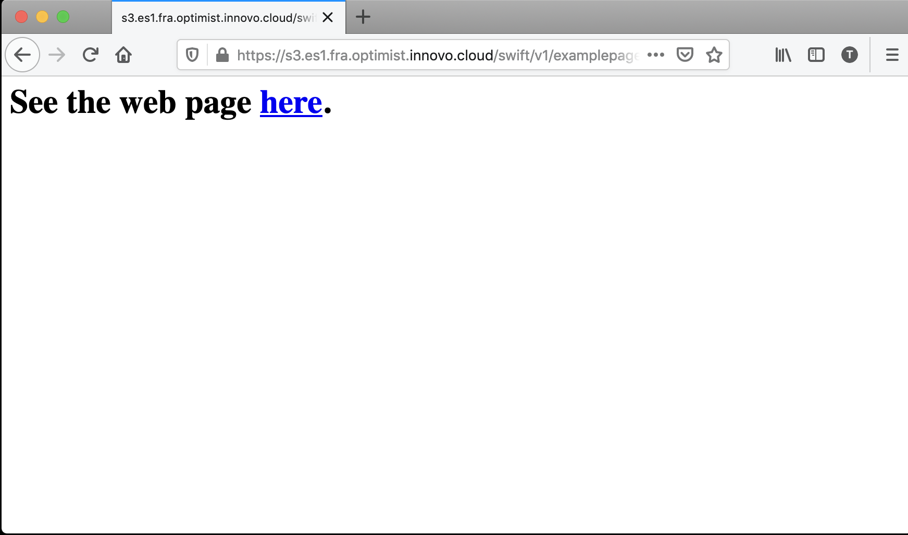
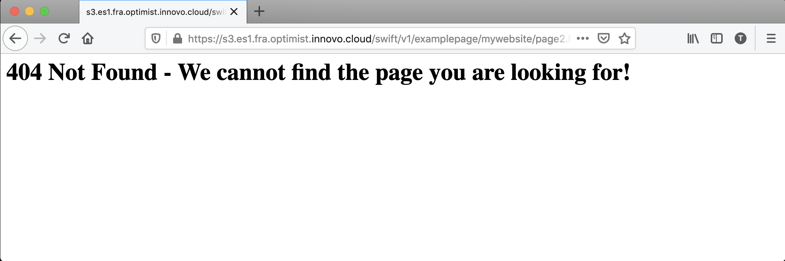

# Swift - Serving Static Websites

# Einführung
Mit Hilfe der Swift-CLI ist es möglich, die Daten in Containern als statische Website auszuliefern. Die folgende Anleitung beschreibt die wichtigsten Schritte, um damit zu beginnen, und enthält auch ein Beispiel.

## Erste Schritte

## Erstellen eines Containers
Zunächst erstellen wir einen Container mit dem Namen `example-webpage`, den wir als Basis für diese Anleitung verwenden werden:
```bash
$ swift post example-webpage
```

## Den Container öffentlich lesbar machen
Als nächstes müssen wir sicherstellen, dass der Container öffentlich lesbar ist:
```bash
$ swift post -r '.r:*,.rlistings' example-webpage
```

## Indexdatei der Seite setzen
Setzen Sie die Indexdatei. In diesem Fall wird index.html die Standarddatei sein, die angezeigt wird, wenn die Seite erscheint:
```bash
$ swift post -m 'web-index:index.html' example-webpage
```

## Dateiliste aktivieren
Optional können wir auch die Dateiliste aktivieren. Wenn Sie mehrere Downloads bereitstellen müssen, ist es sinnvoll, die Verzeichnisliste zu aktivieren:
```bash
$ swift post -m 'web-listings: true' example-webpage
```

## CSS für Dateilisten aktivieren
Aktivieren Sie ein benutzerdefiniertes Listing-Stylesheet:
```bash
$ swift post -m 'web-listings-css:style.css' example-webpage
```

## Fehlerseiten einrichten
Schließlich sollten wir eine benutzerdefinierte Fehlerseite einbinden:
```bash
$ swift post -m 'web-error:error.html' example-webpage
```

# Beispiel-Webseite

Wenn die obigen Schritte abgeschlossen sind, können wir damit beginnen, unsere statische Webseite anzupassen. Das Folgende demonstriert eine schnelle Einrichtung unter Verwendung unseres Containers `example-webpage`

## Anpassen der Seiten index.html, page.html und 404error.html

Dies wird als Startseite dienen, die einen Link zu einer sekundären Seite erstellt.
```html
<!-- index.html -->
<html>
<h1>
See the web page <a href="mywebsite/page.html">here</a>.
</h1>
</html>
```

Die nächste Seite (page.html) zeigt ein Bild namens `sample.png` an:
```html
<!-- page.html -->
<html>

</html>
```

Wir können auch benutzerdefinierte Fehlerseiten hinzufügen. Beachten Sie, dass derzeit nur die Fehler 401 (Nicht autorisiert) und 404 (Nicht gefunden) unterstützt werden. Das folgende Beispiel demonstriert die Erstellung einer 404-Fehlerseite:
```html
<!-- 404error.html -->
<html>
<h1>
404 Not Found - We cannot find the page you are looking for!
</h1>
</html>
```

## Hochladen der Dateien index.html und page.html
Nachdem die Inhalte der Dateien erstellt wurden, laden Sie die Dateien mit den folgenden Befehlen hoch:
````bash
$ swift upload beispiel-webseite index.html
$ swift upload beispiel-webseite meinewebseite/seite.html
$ swift upload beispiel-webseite-meine-website/beispiel.png
$ swift upload beispiel-webseite 404error.html
```

## Betrachten der Website
Wenn alle oben genannten Schritte abgeschlossen sind, können wir nun unsere neu erstellte Website betrachten. Den Link zur Website finden Sie im Optimist Dashboard > Object Store > Containers über den abgebildeten Link.

Wenn Sie auf den Link klicken, wird unsere neu erstellte Website angezeigt:



Klicken Sie auf "here", um zu der Seite zu navigieren, auf der wir unser Beispielbild hochgeladen haben:


Für den Fall, dass wir versuchen, zu einer Seite zu navigieren, die nicht existiert, wird unsere benutzerdefinierte 404-Seite angezeigt:


