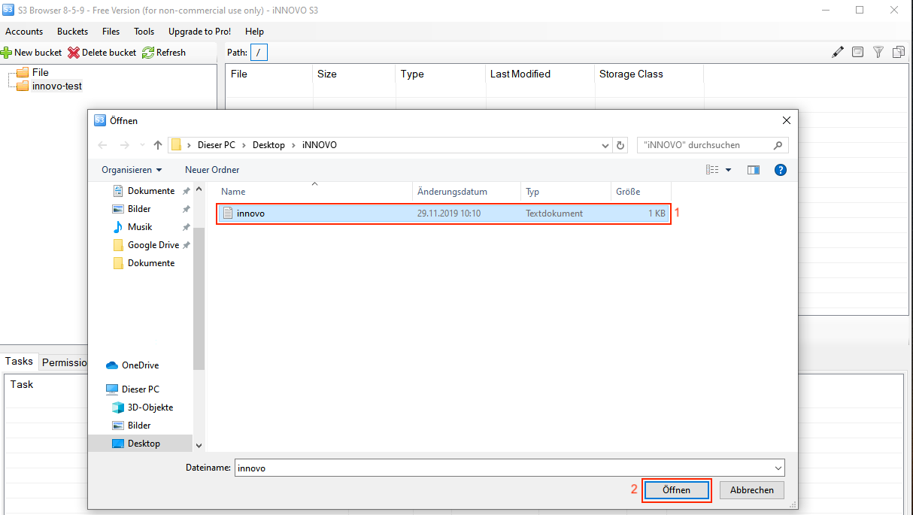
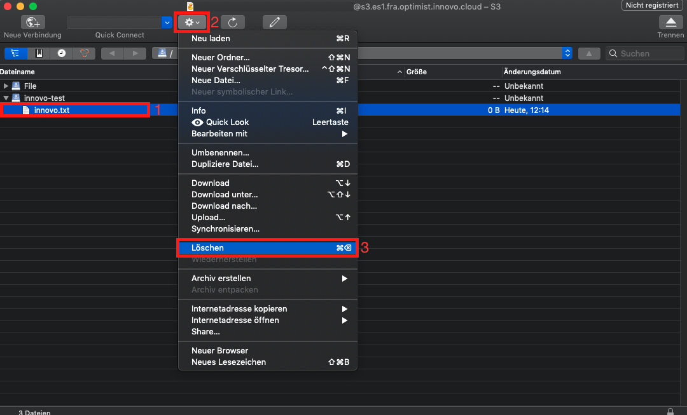

# Ein Objekt hochladen und löschen

## Inhalt:

- [S3cmd](#s3cmd)
- [S3 Browser](#s3browser)
- [Cyberduck](#cyberduck)
- [Boto3](#boto3)

Zum Hochladen Ihrer Daten (z.B. Dokumente, Fotos, Videos, usw.) muss zunächst ein [Bucket](/optimist/storage/s3_documentation/createanddeletebucket/) erstellt werden.
Eine Datei kann nur in einem Bucket gespeichert werden.

## S3cmd

### Hochladen eines Objekts

Nutzen Sie den folgenden Befehl, um eine Datei hochzuladen:

```bash
s3cmd put NameDerDatei s3://NameDesBuckets/NameDerDatei
```

Die Ausgabe in der Kommandozeile kann dann so aussehen:

```bash
$ s3cmd put innovo.txt s3://innovo-test/innovo.txt<font></font>
upload: 'innovo.txt' -> 's3://innovo-test/innovo.txt'  [1 of 1]<font></font>
 95 of 95   100% in    0s   176.63 B/s  done
```

### Löschen eines Objekts

Nutzen Sie den folgenden Befehl, um eine Datei zu löschen:

```bash
s3cmd del s3://NameDesBuckets/NameDerDatei
```

Die Ausgabe in der Kommandozeile kann dann so aussehen:

```bash
$ s3cmd del s3://innovo-test/innovo.txt<font></font>
delete: 's3://innovo-test/innovo.txt'
```

## S3 Browser

### Hochladen eines Objekts

Nach dem Öffnen von S3 Browser, klicken Sie auf den gewünschten *Bucket* (1), wählen Sie *Upload* (2) und anschließend *Upload file(s)* (3).


Wählen Sie die entsprechende Datei (1) aus und klicken Sie auf *Öffnen* (2).



### Löschen eines Objekts

Um eine Datei zu löschen, markieren Sie diese mit einem linken Mausklick (1) und klicken Sie anschließend auf *Delete* (2).


Bestätigen Sie die darauf folgende Abfrage mit *Ja*.

## Cyberduck

### Hochladen eines Objekts

Nach dem Öffnen von Cyberduck, klicken Sie auf den gewünschten Bucket (1), anschließend auf *Aktion* (2) und auf *Upload* (3).


Wählen Sie Ihre Wunsch-Datei aus und klicken Sie auf *Upload*.

### Löschen eines Objekts

Um eine Datei zu löschen, markieren Sie diese mit einem linken Mausklick (1). Löschen Sie dann über *Aktion* (2) und *Löschen* (3) die Datei.



Bestätigen Sie die Löschung durch erneutes Klicken auf *Löschen*.

## Boto3

Bei boto3 brauchen Sie zunächst die S3 Kennung, damit ein Script nutzbar ist. Details finden Sie unter: [S3 Kennung erstellen und einlesen #boto3](/optimist/storage/s3_documentation/createanduses3credentials/#boto3).

### Hochladen eines Objekts

Um eine Datei hochzuladen, müssen Sie einen Client nutzen und den Bucket angeben, in dem die Datei hochgeladen werden soll.

Eine Option sieht so aus:

```bash
## Erstellung eines S3 Clienten
s3 = boto3.client('s3')

## Hochladen einer Datei
s3.upload_file(Bucket='iNNOVO-Test', Key='innovo.txt')
```

Ein komplettes Script für boto 3 einschließlich Authentifizierung kann so aussehen:

```python
#!/usr/bin/env/python

## Definieren das boto3 genutzt werden soll
import boto3
from botocore.client import Config

## Authentifizierung
s3 = boto3.resource('s3',
                        endpoint_url='https://s3.es1.fra.optimist.innovo.cloud',<font></font>
                        aws_access_key_id='aaaaaaaaaaaaaaaaaaaaaaaaaaaaaaaa',<font></font>
                        aws_secret_access_key='bbbbbbbbbbbbbbbbbbbbbbbbbbbbbbbbbb',<font></font>
                    )

## Erstellung eines S3 Clienten
s3 = boto3.client('s3')

## Hochladen einer Datei
s3.upload_file(Bucket='iNNOVO-Test', Key='innovo.txt')
```

### Löschen eines Objekts

Wie beim Hochladen einer Datei, wird zunächst ein Client benötigt und dann die Datei gelöscht.
Dafür geben wir neben der Datei auch den Bucket an, in dem die Datei gespeichert ist.

Eine Option sieht so aus:

```bash
## Erstellung eines S3 Clienten
s3 = boto3.client('s3')

## Löschen eines Objekts
s3.delete_object(Bucket='iNNOVO-Test', Key='innovo.txt')
```

Ein komplettes Script für boto 3 einschließlich Authentifizierung kann so aussehen:

```python
#!/usr/bin/env/python

## Definieren das boto3 genutzt werden soll
import boto3
from botocore.client import Config

## Authentifizierung
s3 = boto3.resource('s3',
                        endpoint_url='https://s3.es1.fra.optimist.innovo.cloud',
                        aws_access_key_id='aaaaaaaaaaaaaaaaaaaaaaaaaaaaaaaa',
                        aws_secret_access_key='bbbbbbbbbbbbbbbbbbbbbbbbbbbbbbbbbb',
                    )

## Erstellung eines S3 Clienten
s3 = boto3.client('s3')

## Löschen eines Objekts
s3.delete_object(Bucket='iNNOVO-Test', Key='innovo.txt')
```
