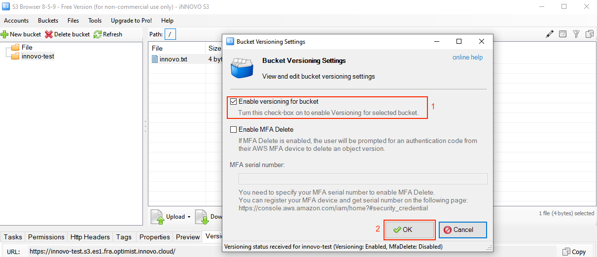
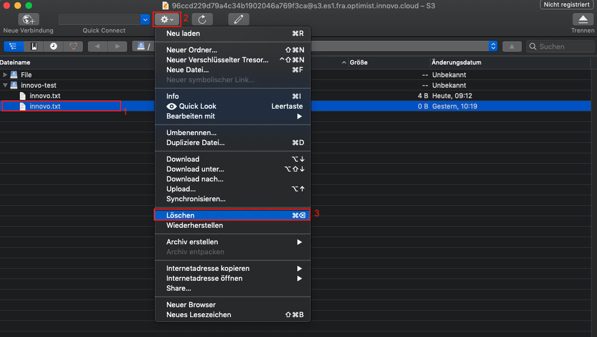

# Versionierung aktivieren/deaktivieren und ein versioniertes Objekt löschen

## Inhalt:

- [S3cmd](#s3cmd)
- [S3 Browser](#s3browser)
- [Cyberduck](#cyberduck)
- [Boto3](#boto3)

Durch Versionierung können mehrere Versionen eines Objekts in einem Bucket aufbewahrt werden.
So können Sie beispielsweise `innovo.txt` (Version 1) und `innovo.txt` (Version 2) in einem einzigen Bucket speichern.
Die Versionierung kann Sie vor den Folgen von unbeabsichtigtem Überschreiben oder Löschen bewahren.

## S3cmd

Mit S3cmd ist es nicht möglich, die Versionierung zu aktivieren oder versionierte Dateien zu löschen.

## S3 Browser

### Versionierung aktivieren

Um die Versionierung zu aktivieren, markieren Sie den gewünschten Bucket (1) mit einem rechten Mausklick. Klicken Sie dann auf *Edit Versioning Settings* (2).


Markieren Sie in dem sich öffnenden Fenster die Checkbox von *Enable versioning for bucket* (1). Bestätigen Sie mit *OK* (2).



### Versionierung deaktivieren

Um die Versionierung zu deaktivieren, markieren Sie den gewünschten Bucket (1) mit einem rechten Mausklick. Klicken Sie dann auf *Edit Versioning Settings* (2).


Entfernen Sie im sich öffnenden Fenster die Checkbox bei *Enable versioning for bucket* (1). Bestätigen Sie mit *OK* (2).


### Versionierte Datei löschen

Dies ist in der Free-Version von S3 Browser nicht möglich.

## Cyberduck

Um die verschiedenen Version einer Datei zu sehen, müssen versteckte Dateien angezeigt werden.
Diese Option finden Sie unter *Darstellung* (1) → *Versteckte Dateien anzeigen* (2).


### Versionierung aktivieren

Nach dem Öffnen von Cyberduck, klicken Sie auf die Datei, für die Sie die Versionierung (1) aktivieren wollen.
Klicken Sie anschließend auf *Aktion* (2) und auf *Info* (3).


Danach öffnet sich das folgende Fenster. Setzen Sie hier den Haken bei *Bucket Versionierung* (1):


### Versionierung deaktivieren

Um die Versionierung zu deaktivieren, markieren Sie wieder eine Datei (1). Gehen Sie dann auf *Aktion* (2) und *Info* (3).


Entfernen Sie in dem sich öffnenden Fenster den Haken bei *Bucket Versionierung*.


### Versionierte Datei löschen

Markieren Sie die zu löschende Datei (1) und entfernen Sie diese über *Aktion* (2) → *Löschen* (3).



## Boto3

Bei boto3 brauchen Sie zunächst die S3 Kennung, damit ein Script nutzbar ist. Details finden Sie unter: [S3 Kennung erstellen und einlesen #boto3](/optimist/storage/s3_documentation/createanduses3credentials/#boto3).

### Versionierung aktivieren

Um einen Bucket zu erstellen, müssen Sie einen Client nutzen und anschließend den Bucket erstellen.
Eine Option sieht so aus:

```bash
## Angabe des Buckets in dem die Versionierung aktiviert werden soll
bucket = s3.Bucket('iNNOVO-Test')

## Versionierung aktivieren
bucket.configure_versioning(True)
```

Ein komplettes Script für boto 3 einschließlich Authentifizierung kann so aussehen:

```python
#!/usr/bin/env/python

## Definieren das boto3 genutzt werden soll
import boto3
from botocore.client import Config

## Authentifizierung
s3 = boto3.resource('s3',
                        endpoint_url='https://s3.es1.fra.optimist.innovo.cloud',
                        aws_access_key_id='aaaaaaaaaaaaaaaaaaaaaaaaaaaaaaa',
                        aws_secret_access_key='bbbbbbbbbbbbbbbbbbbbbbbbbbbbbbbb',
                    )

## Angabe des Buckets in dem die Versionierung aktiviert werden soll
bucket = s3.Bucket('iNNOVO-Test')

## Versionierung aktivieren
bucket.configure_versioning(True)
```

### Versionierung deaktivieren

Wie bei der Aktivierung der Versionierung benötigen Sie zunächst den Bucket, um die Versionierung zu deaktivieren.
Eine Option sieht so aus:

```bash
## Angabe des Buckets in dem die Versionierung deaktiviert werden soll
bucket = s3.Bucket('iNNOVO-Test')

## Versionierung deaktivieren
bucket.configure_versioning(False)
```

Ein komplettes Script für boto 3 einschließlich Authentifizierung kann so aussehen:

```python
#!/usr/bin/env/python

## Definieren das boto3 genutzt werden soll
import boto3
from botocore.client import Config

## Authentifizierung
s3 = boto3.resource('s3',
                        endpoint_url='https://s3.es1.fra.optimist.innovo.cloud',
                        aws_access_key_id='aaaaaaaaaaaaaaaaaaaaaaaaaaaaaaa',
                        aws_secret_access_key='6229490344a445f2aa59cdc0e53add88',
                    )

## Angabe des Buckets in dem die Versionierung deaktiviert werden soll
bucket = s3.Bucket('iNNOVO-Test')

## Versionierung deaktivieren
bucket.configure_versioning(False)
```

### Versioniertes Objekt löschen

Um ein versioniertes Objekt komplett zu löschen, ist der folgende Befehl hilfreich:

```bash
## Angabe des Buckets in dem das versionierte Objekt gelöscht werden soll
bucket = s3.Bucket('iNNOVO-Test')

## Versioniertes Objekt löschen
bucket.object_versions.all().delete('innovo.txt')
```
